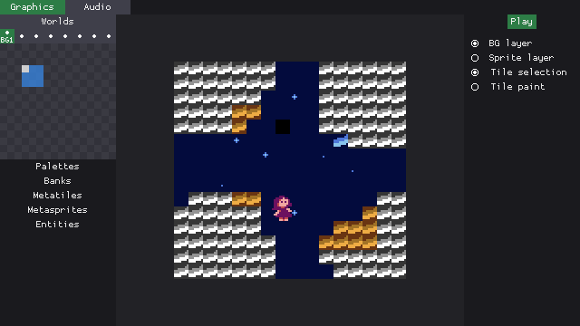
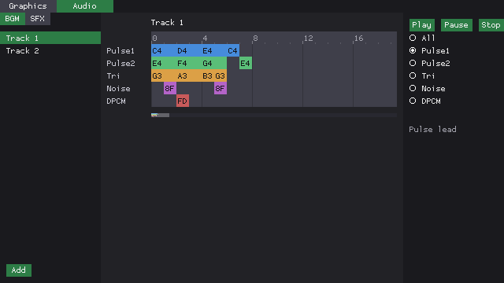
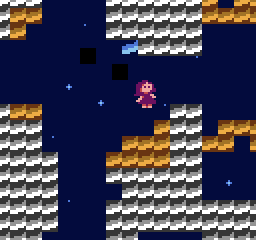
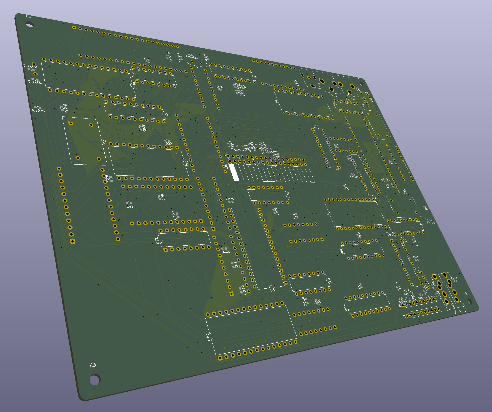

Retr01 is an MCU-assisted 8-bit system, complemented by a software toolchain. The software consists of 3 different (WIP) packages:

- **Retr01 Studio**: the game editor. Draw maps, tiles, and sprites, then hit **Play** to try your game (same picture as the emulator).
- **Retr01 Emu**: the standalone game player. Runs a cartridge image on your computer. Studio Play uses this same engine.
- **Retr01 Sim**: the board simulator. Shows the ICs and wiring of the motherboard so we can bring up the real design before hardware.

This is the overall hardware roadmap:

- **Retr01-A and Retr01-C** (Arcade and Console): One THT board for both shells. Same **23-IC** core, [**36-pin cart**](docs/cart.md), **RGBS + composite**, 5 V barrel. Arcade microswitch headers **and** PCB footprints for **2x Switchcraft 35RAPC** TRS ([`docs/controllers.md`](docs/controllers.md)).
- **Retr01-H (stage 2)**: Handheld. SMD, battery, LCD + driver, contact pads. Same software contract. It will also include 3.5mm ports for controllers and possibly one more for mono audio + composite.

## Apps

`./build-all` builds Release **Studio**, **Emu**, and **Sim** into `bin/`. `./studio`, `./emu`, and `./sim` (at root) run those binaries. `./unit-tests` runs their test suites.

## Main specs

| Aspect | Description |
|--|--|
| CPU | W65C02S @ **8 MHz** |
| Playfield | **128 x 120** of logical resolution (**16 x 15** tiles), board **2x** to **256 x 240** RGBS field |
| Art | **8 x 8** tiles, **2 bpp**, **64** master colors on-board Color PROM IC |
| Worlds | up to **8** worlds x **48** screens each (384-screen "real state"). All within a 512KB cartridge |
| Scroll | **2 x 2** live nametable window + **true second BG** (SNES-like parallax via color-0 show-through) |
| Sprites | **64** OAM entries, **16** per scanline |
| VRAM / RAM | **32 KB** interleaved VRAM + **32 KB** system RAM |

In cartridge, same **32 KB PRG** as classic NES NROM games (Exitebike, Balloon Fight, Ice Climbers) but it buys far more game: **4.5x** more CPU cycles per frame at **8 MHz**, **32 KB** system RAM (not 2 KB). Scroll, sprite line fill and world map streaming are hardware jobs, so PRG stays game logic, not VBlank nametable tricks. A structured **BG0** far plane scrolls under BG1 (color **0** windows) for real dual-layer parallax, not a mapper hack. See [`docs/selling_points.md`](docs/selling_points.md).

## Screenshots (scaled to 1x)

Peek at Retr01 Studio:

Emulator + Debug screen:

Sim:

PCB prototype V3 (not tested):

## Where to go next

- [`docs/graphics.md`](docs/graphics.md): VRAM, BG0/BG1, sprites, palettes, graphics ports
- [`docs/selling_points.md`](docs/selling_points.md): NES vs Retr01, including **SNES-like parallax (BG0)**
- [`docs/memory.md`](docs/memory.md): chips, cart layout, read/write timing
- [`docs/hardware.md`](docs/hardware.md): IC BOM, block diagram, bring-up (chips only)
- [`docs/cart.md`](docs/cart.md): cartridge pinout, form factor, USB-C flasher
- [`docs/controllers.md`](docs/controllers.md): Retr01-A arcade vs Retr01-C pad protocol
- [`docs/lightgun.md`](docs/lightgun.md): CRT light gun accessory (roadmap)
- [`docs/passive_rf_etc.md`](docs/passive_rf_etc.md): passives, ports, stackup / RF
- [`docs/sound.md`](docs/sound.md): APU and bytecode
- [`hw/`](hw/): part list + [`hw/md/`](hw/md/) chip notes

Built for people who want to *make* 8-bit games, not only play them.
