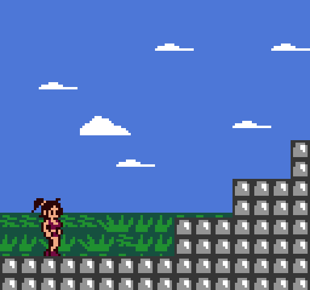
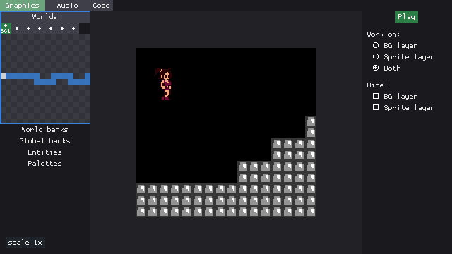
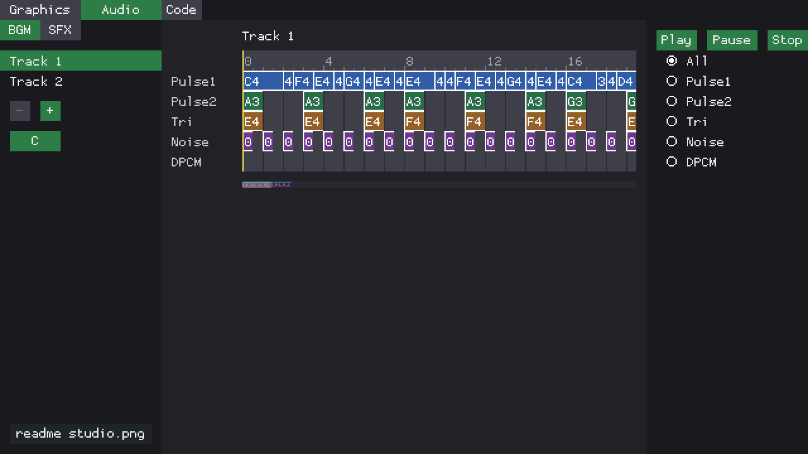

Retr01 is an MCU-assisted 8-bit game system for arcade and console setups, plus an emulator and a studio for making games and content.

Hardware is still in development, and the software is being built around that design.

## Inspirations

1. **NES: readable limits and bold color.** Retr01 uses a 64-color global palette, with up to 25 colors visible on screen at once. Like the NES, those constraints are intentional: they keep graphics cohesive, make pixel art approachable, and give every color choice more weight.
2. **SNES: depth without unnecessary complexity.** Two true background planes and pixel-level transparency enable real parallax, layered scenery, and richer scene composition while keeping the graphics pipeline understandable and close to the hardware.
3. **[GameTank console](https://gametank.zone/)**: The main inspiration for the project. Retr01 uses a similar resolution, also scaled to 2x (by default), small cartridges and a hackable, understandable design.

## Graphics

The playfield is 128x120 with chunky pixels, NES-style color limits, and two real background layers. The result is a sharp image with a simple hardware pipeline.

Architecturally speaking, the graphics are based on worlds and screens: up to 8 worlds, 64 screens each (512 _TV screens_ of real state). Together with dual background layers, that can make for visual storytelling that feels much larger than the resolution suggests.

Characters and objects are entities made from states, frames, and sprites (a _state_ being something like idle, running, or crouching). Hardware draws the background layers and sprites so PRG can focus on game logic instead of pushing every pixel.

## Audio

Retr01 uses 8 channels shared between music and effects. Five are reserved for the soundtrack and three for effects so a jump or shot does not mute the song. This was designed to work differently from many small systems where sound effects compete directly with the music.

The game program writes notes and a helper chip (an AVR128DB28) mixes them to analog output. See [sound.md](docs/general/sound.md).

## Hardware

The design uses one compact through-hole board for both home-console and arcade cabinet builds. The same PCB can be populated as a console (using 3.5mm connectors for gamepads) or as an arcade board (with cabinet-oriented I/O).

A W65C02S runs the game logic, while a few helper chips and small glue logic handle video, inputs, saves, and audio mixing. Output is dual sync RGB (RGBS and RGBHV) and composite. The cartridge is a simple, serviceable part of the system rather than a black box.

## Software pieces

Retr01 Emu runs .retr01 ROM images.

Retr01 Studio is the authoring tool for worlds, screens, and entities. It includes the emulator for quick playtesting.

BGM tracker:

## Doc map

- [selling-points.md](docs/general/selling-points.md): Product vision, shared PCB design, dual-sync output, entity model, flash support, and other system ideas.
- [hardware.md](docs/general/hardware.md): Main hardware reference for the board, support chips, PLD logic, BOM choices, I/O, and compact PCB layout.
- [ic-comms-risks.md](docs/general/ic-comms-risks.md): Shared-bus and multi-clock communication risks, likely failure points, and anti-patterns to avoid.
- [video-graphics.md](docs/general/video-graphics.md): Resolution, tile layout, sprites, palettes, background layers, and the hardware work behind the graphics pipeline.
- [palette/](docs/general/palette/README.md): The fixed 64-color palette kit and export guidance for GIMP and Aseprite.
- [world-scrolling.md](docs/general/world-scrolling.md): World and screen structure, VRAM buffering, sparse map organization, and scrolling over large areas.
- [cartridge.md](docs/general/cartridge.md): Cartridge hardware, passive memory model, save support, flash workflow, and the basic cart layout.
- [memory.md](docs/general/memory.md): CPU address map, soft $7Fxx windows, MAP port behavior, .retr01 image format, and flash capacity limits.
- [software-api.md](docs/general/software-api.md): Runtime model for entities, data structure sizing, C and ASM API, and expected game modes.
- [sound.md](docs/general/sound.md): Audio architecture, 8-channel software mix, $7F40 register window, 6502 NMI tracker bytecode, and PWM output.
- [open-questions.md](docs/general/open-questions.md): Remaining unknowns and design decisions that still need validation.
- [ic_behavior/](docs/ic_behavior/README.md): Per-chip behavior, role, optional variants, and key caveats.
- [bringup/](docs/bringup/README.md): Hardware bring-up roadmap from early lab validation to a console-style demo with controls and audio.
- [apps/README.md](apps/README.md): Studio authoring app, Emu runtime, and the discrete-IC board simulation app.
