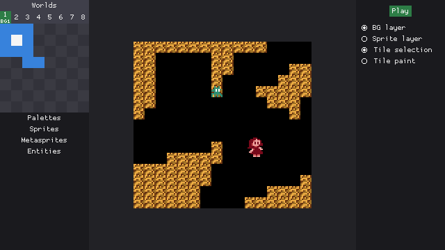
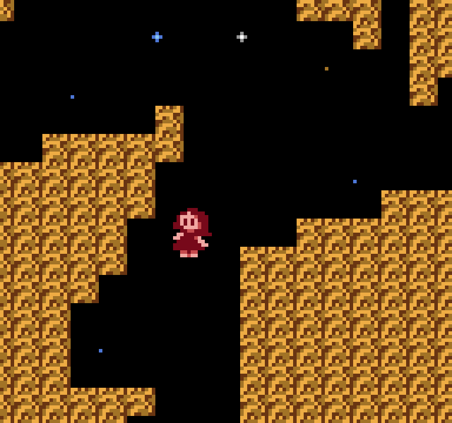
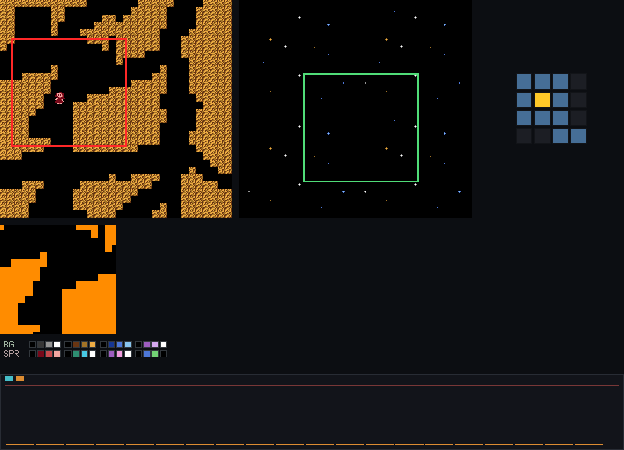
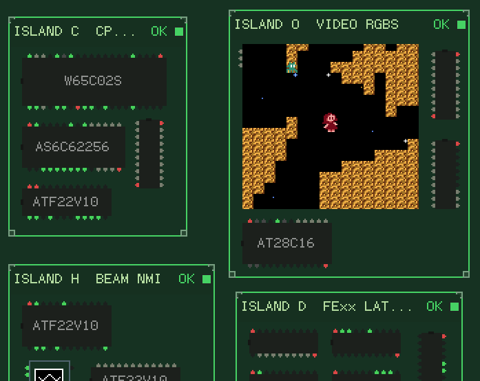

The Retr01 project is a software tool chain + hardware family. Software includes:

- **Retr01 Studio**: visual authoring for worlds, screens and game entities. **Play** exports a cart and opens the shared emulator render screen (same pixels as standalone emu).
- **Retr01 Emu**: software-visible 65C02 + `$FExx` I/O + video. Standalone `./emu` and the library Studio Play uses. Loads a cart, runs PRG boot catchup and Host Play for movement, camera, and collision.
- **Retr01 Sim**: pin-level model of the **32-IC** motherboard netlist. Interactive SDL board UI with draggable islands, per-chip tests, and the same cart boot path as the emulator.

Software is still a WIP. This is the overall hardware roadmap:

- **Retr01-A (stage 1 arcade)** / **Retr01-C (stage 1 console)**: One THT board (~**14 x 12 cm**, 4-layer) for both shells. Same 32-IC core, [**36-pin cart**](docs/cart.md), RGBS / S-Video / composite, 5 V barrel. Arcade microswitch headers **and** PCB footprints for **2x Switchcraft 35RAPC** TRS ([`docs/controllers.md`](docs/controllers.md)). Shell + population choose I/O path, not two mobos.
- **Retr01-H (stage 2)**: Handheld. SMD, battery, LCD + driver, contact pads. Same software contract.

## Software tree

Apps and shared code live under [`retr01/`](retr01/):

| Path | Role |
|--|--|
| `retr01/studio/` | Authoring app |
| `retr01/emu/` | Cart emulator (+ Studio Play core) |
| `retr01/sim/` | Pin-level board simulator |
| `bin/` | Release binaries from `./build-all` (`studio`, `emu`, `sim`) |

`./build-all` builds Release binaries into `bin/`. `./studio`, `./emu`, and `./sim` only run those binaries. `./unit-tests` runs the test suites.

## At a glance

| Aspect | Description |
|--|--|
| CPU | W65C02S @ **8 MHz** |
| Playfield | **128 x 120** logical (**16 x 15** tiles), board **2x** to **256 x 240** RGBS |
| Art | **8 x 8** tiles, **2 bpp**, **64** master colors on-board Color PROM (**AT27C256R**) |
| Worlds | up to **8** worlds, **32** BG1 screens each + optional **BG0** on a **512 KB** cart (**32 KB** PRG) |
| Scroll | **2 x 2** live nametable window (BG1) + structured second BG (BG0) with show-through |
| Sprites | **64** OAM entries, **16** per scanline |
| VRAM / RAM | **32 KB** interleaved VRAM + **32 KB** system RAM |

Same **32 KB PRG** as classic NES NROM games (Exitebike, Balloon Fight, Ice Climbers) but it buys far more game: **4.5x** more CPU cycles per frame at **8 MHz**, **32 KB** system RAM (not 2 KB). Scroll, sprite line fill and world map streaming are hardware jobs, so PRG stays game logic, not VBlank nametable tricks. See [`docs/selling_points.md`](docs/selling_points.md).

## Screenshots

Peek at Retr01 Studio:

Emulator + Debug screen:

Sim:

## Where to go next

- [`docs/graphics.md`](docs/graphics.md): VRAM, BG0/BG1, sprites, palettes, graphics ports
- [`docs/memory.md`](docs/memory.md): chips, cart layout, read/write timing
- [`docs/hardware.md`](docs/hardware.md): IC BOM, block diagram, bring-up (chips only)
- [`docs/cart.md`](docs/cart.md): cartridge pinout, form factor, USB-C flasher
- [`docs/controllers.md`](docs/controllers.md): Retr01-A arcade vs Retr01-C pad protocol
- [`docs/passive_rf_etc.md`](docs/passive_rf_etc.md): passives, ports, stackup / RF
- [`docs/sound.md`](docs/sound.md): APU and bytecode
- [`docs/selling_points.md`](docs/selling_points.md): NES vs Retr01 comparison
- [`hw/`](hw/): part list + [`hw/md/`](hw/md/) chip notes

Built for people who want to *make* 8-bit games, not only play them.
