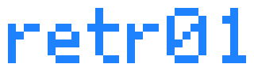

The retr01 project is a modern, discrete-logic 8-bit hardware family, built to be understood, hacked, and shipped. 3 hardware variants are planned, starting by the arcade board.

Project status: Docs, Design, Emulation and Simulation.

Overall roadmap:

| Stage | Device/PCB | Description |
|---|---|---|
| 1 | **retr01-A** | Arcade motherboard, the first build. Uses THT components and doesn't worry too much about PCB size.  |
| 2 | **retr01-C** | Home console. We'll have to mind the board size for this one and use controllers (3-cable line planned). |
| 3 | **retr01-H** | Handheld. This is the most challenging task. Will use SMD components, multiple boards, LCD, battery, etc. |

The arcade board: something you can drop into a cabinet, wire to sticks and buttons, and run games that look and play like classic 8-bit tile/sprite games. A world model and CPU budget built for large designs.

For the full product pitch and **NES comparison tables**, see [`docs/07_pitch.md`](docs/07_pitch.md).

## Why it exists

Most retro projects either emulate the past exactly or leave the aesthetic behind. retr01 keeps the 8-bit look (8x8 tiles, 2bpp art, cartridge games) and redesigns the plumbing for easily navigable, multi-world games, multi-screen worlds, smoother scrolling and simple parallax integration, without VBlank-only nametable updates.

Details and fair NES comparisons: [`docs/07_pitch.md`](docs/07_pitch.md).

## What you get (in plain terms)

- **A real arcade-first board:** sticks, buttons, coin/start, analog RGBS/S-Video/composite pads for cabinet monitors. RGBS pads can also feed an off-the-shelf analog-to-HDMI converter if you want a modern TV
- **A bold but readable look:** limited color per tile/sprite on purpose, with clarity over mush
- **Big cartridge worlds:** up to **8 worlds**, **32 screens** each, on a **512 KB** cart
- **Chunky 128x120** playfields (**16x15** tiles) with board **2x** into a **256x240** RGBS raster (fills CRT, no letterbox)
- **Smooth multi-screen scrolling:** cameras that cross screen borders using a 2x2 live nametable window (see pitch doc)
- **retr01 Studio:** visual tool to author worlds and export `.retr01` cart images

Later editions (console and handheld) share the same soul: one architecture, different shells.

### Root helpers

One action per invocation:

| Script | Examples |
|--------|----------|
| [`./studio`](studio) | `build` * `run` * `build-run` * `unit` * `e2e` * `e2e-watch [speed]` |
| [`./emu`](emu) | `build` * `run [cart]` * `build-run` * `unit` |
| [`./sim`](sim) | `build` * `run` * `build-run` * `unit` |

```bash
./studio help
./emu build-run
./sim unit
```

---

Built for people who want to *make* 8-bit games, not only play them.
