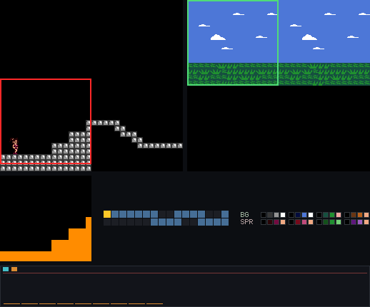
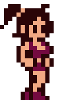
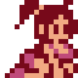
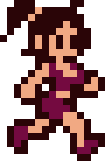

The Retr01 project is an MCU-assisted 8-bit system ready for arcade and console setups. It is also an Emulator and a Studio.

NOTE: hardware is still in design phase, software is being built on that design.

## Inspirations

1. NES (tile and sprite feel, 2bpp, NES-style color limits).
2. SNES (true parallax via two BG planes).
3. [GameTank](https://gametank.zone/) (similar screen resolution target).

## Design goals

- Most video work sits in hardware so the CPU can spend cycles on gameplay, inputs, physics, and state updates instead of low-level tile and sprite work.
- The main PCB stays compact: roughly 17 ICs total. The design is hybrid, not a pure FPGA and not a pure discrete-logic console.
- The split is a middle ground between custom logic and MCU helpers: a main CPU, a few AVR support chips, PLDs, and a small amount of 74xx glue.
- The CPU has a flat 32 KB program space with no banking. At 8 MHz and with 32 KB RAM, the system can do more than a classic NES-style NROM cartridge while staying simple to author.
- The entity model (entities are sprite compositions) has clear caps: up to 32 entity types cart-wide, each with up to 4 states, 8 frames per state, and 6 sprites per frame.
- World layouts stay flexible: up to 8 worlds, each with up to 64 screens, arranged on a sparse 16x16 grid so large maps do not need dense, wasteful allocation.
- Pattern banks are cart-wide (16 BG + 16 SPR). Each tile and sprite names its bank. There is no mapper and no latched "current bank" for the picture.
- The cartridge is passive: no mapper or bank switching. Nametable and map data can stream directly from cart memory into VRAM buffers. That keeps the bus simpler and leaves program space free for game code.

## Software pieces

**Retr01 Emu** runs `.retr01` ROM (cartridge) images:

**Retr01 Studio** is the authoring app for worlds, screens, and entities. It embeds the emulator in-editor for immediate playtest.

Maria is a player entity used to test Emu and Studio. It may become a full game later. Idle, running, crouching, and jumping are entity states (up to 4 states x 8 frames x 6 sprites):

## Doc map

- [selling-points.md](general_docs/selling-points.md): The broader product and design vision: the shared-PCB approach, dual-sync output, entity model, flash support, and extra features that make the platform feel like a full console instead of a bare tech demo.
- [hardware.md](general_docs/hardware.md): The main hardware reference: board layout, the three AVR support chips, PLD logic, BOM choices, I/O plumbing, and PCB decisions that keep the system compact and practical.
- [ic-comms-risks.md](general_docs/ic-comms-risks.md): Shared-bus and multi-clock communication risks: where failures are likely, and which mitigations or anti-patterns to avoid.
- [video-graphics.md](general_docs/video-graphics.md): The graphics system: resolution, tile layout, sprites, palettes, background layers, and how much rendering work sits in hardware rather than on the CPU.
- [palette/](general_docs/palette/README.md): The fixed 64-color palette kit, plus export guidance for GIMP and Aseprite so art stays consistent with the console color and indexing constraints.
- [world-scrolling.md](general_docs/world-scrolling.md): World and screen structure, VRAM buffering, sparse map organization, and scroll behavior over large map areas without wasteful dense allocation.
- [cartridge.md](general_docs/cartridge.md): The cartridge hardware story: passive memory model, save support, flash workflows, and a simple cart layout that keeps the bus uncomplicated.
- [memory.md](general_docs/memory.md): The memory map: CPU address layout, soft `$7Fxx` windows, MAP port behavior, `.retr01` image format, and entity flash capacity limits.
- [software-api.md](general_docs/software-api.md): The runtime model for entities, data structure sizes, the C/ASM API, and the game modes the software is expected to support.
- [sound.md](general_docs/sound.md): The audio architecture: 8-channel software mix on MCU-S2, the `$7F40` register window, 6502 NMI tracker bytecode, and PWM out.
- [open-questions.md](general_docs/open-questions.md): Unknowns and open design decisions, with notes on what still needs validation and how each remaining question gets resolved.
- [ic_behavior/](ic_behavior/README.md): A per-chip description for each part in the BOM: behavior, role, optional variants, and key caveats.
- [bringup/](bringup/README.md): The late hardware bring-up roadmap, ordered by tiers A-H from video lab validation through a full console-style demo with controllers and audio.
- [apps/README.md](apps/README.md): The app layer: Studio authoring workflow and the Emu runtime used to test content.
