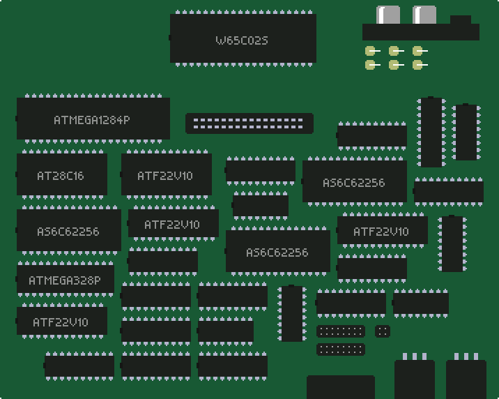

(this is a concept PCB, not a final design. That said, the quantity/shape of ICs is accurate-ish)

The Retr01 project is a modern, discrete-logic 8-bit hardware family, built to be understood, hacked, and shipped. 3 hardware variants are planned, starting by the arcade board.

Project status: Docs, Design, Emulation and Simulation.

Overall roadmap:

| Stage | Device/PCB | Description |
|---|---|---|
| 1 | **Retr01-A** | Arcade motherboard, the first build. Uses THT components and doesn't worry too much about PCB size.  |
| 2 | **Retr01-C** | Home console. We'll have to mind the board size for this one and use controllers (3-cable line planned). |
| 3 | **Retr01-H** | Handheld. This is the most challenging task. It will use SMD parts, contact pads, screen + screen driver, battery, etc. |

The arcade board: something you can drop into a cabinet, wire to sticks and buttons, and run games that look and play like classic 8-bit tile/sprite games. A world model and CPU budget built for large designs.

## Why it exists

Most retro projects either emulate the past exactly or leave the aesthetic behind. Retr01 keeps the 8-bit look (8x8 tiles, 2bpp art, cartridge games) and redesigns the plumbing for multi-screen worlds, smoother scrolling, and simple parallax, without VBlank-only nametable updates. Studio supports multi-world **authoring** today. Cart export is **world 0** only.

Technical specs: [`docs/01_architecture_overview.md`](docs/01_architecture_overview.md), [`docs/02_graphics_worlds_memory.md`](docs/02_graphics_worlds_memory.md).

## What you get (in plain terms)

- **A real arcade-first board:** sticks, buttons, coin/start, analog RGBS/S-Video/composite pads for cabinet monitors. RGBS pads can also feed an off-the-shelf analog-to-HDMI converter if you want a modern TV
- **A bold but readable look:** limited color per tile/sprite on purpose, with clarity over mush
- **Big cartridge worlds:** up to **8 worlds**, **30 screens** each, on a **512 KB** cart
- **Chunky 128x120** playfields (**16x15** tiles) with board **2x** into a **256x240** RGBS raster (fills CRT, no letterbox)
- **Smooth multi-screen scrolling:** cameras that cross screen borders using a 2x2 live nametable window (see [`docs/02`](docs/02_graphics_worlds_memory.md))
- **Retr01 Studio:** visual tool to author worlds and export `.retr01` cart images

Later editions (console and handheld) share the same soul: one architecture, different shells.

### Scripts

Thin wrappers at the repo root forward to [`scripts/`](scripts/):

| Script | Usage |
|--------|--------|
| [`studio`](studio) | `./studio rom/test.r01proj` |
| [`emu`](emu) | `./emu rom/test.retr01` |
| [`sim`](sim) | `./sim rom/test.retr01` |
| [`unit-tests`](unit-tests) | build + ctest for Studio, Emu, and Sim |
| [`export-rom`](export-rom) | `./export-rom [project.r01proj] [stem]` |
| [`build-all`](build-all) | Release builds -> `release/retr01_{studio,emu,sim}` |

```bash
./build-all
./unit-tests
./studio rom/test.r01proj
./export-rom rom/test.r01proj
./emu rom/test.retr01
./sim rom/test.retr01
```

**ROM output:** Studio **Ctrl+E** (or `./export-rom`) writes cart images under [`rom/`](rom/) at the repo root.

---

Built for people who want to *make* 8-bit games, not only play them.
