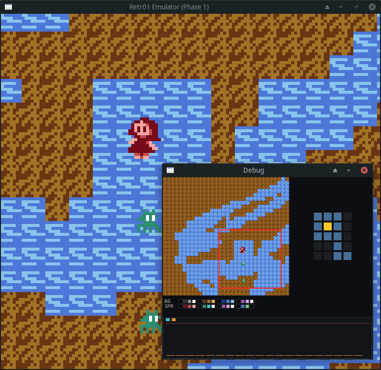

Retr01 is a discrete-logic 8-bit hardware family built to be understood, hacked, and shipped. One CPU model, one graphics model, one cart format across three planned form factors. The repo holds the architecture spec, **Retr01 Studio** authoring tool, cart emulator, and pin-level board simulator.

**Status:** Docs, design, emulation, and simulation. Hardware v1 target is the **32-IC** Retr01-A arcade board (~14 x 12 cm THT minimum).

## Roadmap

| Stage | Device | Description |
|---|---|---|
| 1 | **Retr01-A** | Arcade motherboard. THT, cabinet sticks/buttons, RGBS / S-Video / composite. First build. |
| 2 | **Retr01-C** | Home console. Same architecture, smaller board, 3-wire controllers. |
| 3 | **Retr01-H** | Handheld. SMD, battery, LCD + driver, contact pads. Same software contract. |

Retr01-A drops into a cabinet and runs tile/sprite games with multi-screen worlds, smooth scrolling, and parallax-friendly VRAM. Not a NES clone ---> a redesigned 8-bit pipeline for large maps.

## At a glance

| | |
|--|--|
| CPU | W65C02S @ **8 MHz** |
| Playfield | **128 x 120** logical (**16 x 15** tiles), board **2x** ---> **256 x 240** RGBS |
| Art | **8 x 8** tiles, **2 bpp**, **64** master colors on-board Color PROM |
| Worlds | Up to **8** worlds, **32** screens each on a **512 KB** cart (**32 KB** PRG) |
| Scroll | **2 x 2** live nametable window crossing screen borders |
| Sprites | **64** OAM entries, **16** per scanline |
| VRAM / RAM | **32 KB** interleaved VRAM + **32 KB** system RAM |

Same **32 KB PRG** as classic NES NROM, but it buys far more game: **~4.5x** cycles per frame at **8 MHz**, **32 KB** system RAM (not 2 KB), and scroll, sprite line fill, and MAP streaming are hardware jobs ---> PRG stays game logic, not VBlank nametable tricks. [`why_32kb_prg_is_good_enough.md`](docs/why_32kb_prg_is_good_enough.md)

Full map, cart layout, and `$FExx` ports: [`docs/02_graphics_worlds_memory.md`](docs/02_graphics_worlds_memory.md). Terminology and BOM: [`docs/01_architecture_overview.md`](docs/01_architecture_overview.md).

## Software

Three tools share one cart image (`.retr01`) and one Play contract (`common/` runtime):

| Tool | Role |
|------|------|
| [**Retr01 Studio**](retr01_studio/README.md) | Author worlds, tiles, sprites, entities. **Play** preview. **Ctrl+E** export ---> cart + generated `output/C/`, `output/ASM/`, `output/data/`. |
| [**Retr01 Emulator**](retr01_emu/README.md) | Software-visible 65C02 + `$FExx` + video. Loads a cart, runs PRG boot catchup, host Play for movement/camera. |
| [**Board simulator**](retr01_sim/README.md) | Pin-level model of the **32-IC** netlist. Interactive SDL board UI, island tests, same cart boot path as emu. |


Studio **Save** writes `output/<stem>.r01proj`. Export packs **world 0** today (multi-world authoring in UI, single-world cart). User hooks live in `output/C/custom_logic.c` (created once, never overwritten).

## Quick start

```bash
./build-all
./unit-tests
./studio output/test.r01proj    # author + Play
./export-rom                    # or Ctrl+E in Studio
./emu output/test.retr01
./sim output/test.retr01
```

Root wrappers (`studio`, `emu`, `sim`, ...) forward to [`scripts/`](scripts/). Release binaries land in `release/`.

## Documentation

| | |
|--|--|
| [`docs/01`](docs/01_architecture_overview.md) | Architecture, terminology, doc index |
| [`docs/02`](docs/02_graphics_worlds_memory.md) | Software SoT: VRAM, cart, registers |
| [`docs/05`](docs/05_hardware_v1_32ic.md) | 32-IC BOM and netlist |
| [`docs/07`](docs/07_game_modules.md) | Movement, camera, entities, CPU budgets |
| [`hw/`](hw/) | Datasheet PDFs + [`hw/md/`](hw/md/) chip notes |

---

Here's a picture of teh emulator, just for fun:


Built for people who want to *make* 8-bit games, not only play them.
