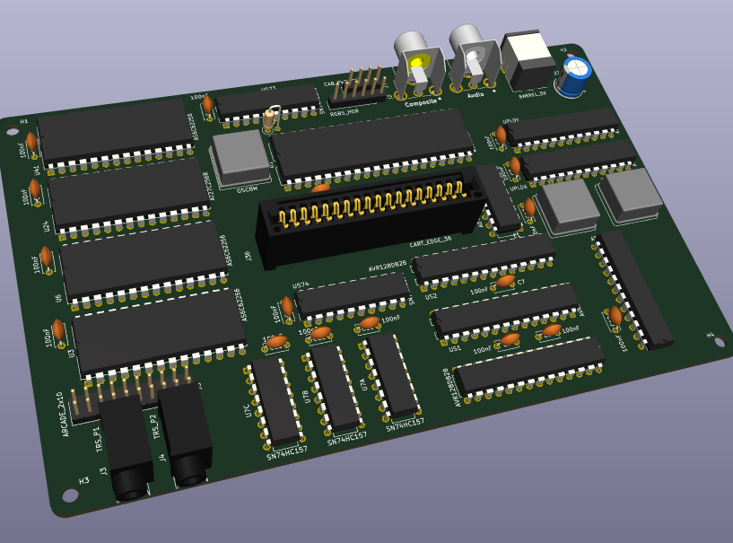

Retr01 is an MCU-assisted 8-bit game system for arcade and console setups, plus an emulator and a studio for making games and content.

Hardware remains in active development/design. Software, tooling, and documentation track that ongoing specification. The board layout shown above is an early revision and is intended to approximate the planned main PCB.

## Inspirations

1. **NES: readable limits and bold color.** Retr01 uses a 64-color global palette, with up to 25 colors visible on screen at once. Those limits are on purpose. They keep the graphics simple, make pixel art easier to work with, and give every color choice more weight.
2. **SNES: depth without unnecessary complexity.** Two true background planes and pixel-level transparency enable real parallax, layered scenery, and richer scene composition while keeping the graphics pipeline understandable and close to the hardware.
3. **[GameTank console](https://gametank.zone/)**: The primary modern inspiration. Retr01 takes the same core ideas of a modest resolution, physical (small) cartridges and a readable multi-chip design that stays understandable instead of hiding behind an FPGA. It applies those ideas to a simple tile-based background and CHR system built around high-level _game entities_ rather than raw sprites, with clear VRAM windows and camera logic, all aimed at new games.

## Graphics

The playfield is 128x120 with chunky pixels, NES-style color limits, and two real background layers. The result is a sharp image with a simple hardware pipeline.

Architecturally speaking, the graphics are based on worlds and screens: up to 8 worlds, 64 screens each (512 _TV screens_ of real state). All within a 512KB cartridge.

Characters and objects are entities made from states, frames, and sprites (a _state_ being something like idle, running, or crouching). Hardware draws the background layers and sprites so PRG can focus on game logic instead of pushing every pixel.

## Audio

Retr01 uses 8 channels shared between BGM and SFX. Channels are fully independent, so a jump or shot does not temporarily mute a BGM channel.

The game program writes notes and a helper chip (an AVR128DB28) mixes them to analog output. See [sound.md](docs/general/sound.md).

## Hardware

The design uses one compact through-hole main board with ~17 ICs (CPU + MCUs + SPLDs + some 74xx glue) for both home-console and arcade cabinet builds. That is, the same PCB can be populated as a console (using 3.5mm TRS ports for gamepads and RCA connectors for composite and audio) or as an arcade board (RGBS/RGBHV output + pin headers for microswitches).

As for the cartridge, it's a simple and small PCB (close to Game Boy size) with a 32-pin 512KB flash unit + a small 8-pin EEPROM IC for saves. 18 gold finders per side.

Game pads are planned to use 3 wires (3.5mm TRS connections, as mentioned above, so any audio aux cable can be used), and a serial protocol for communication (using an ATtiny). Everything officially supported as both THT and SMT! (with one exception: the chip to generate composite video).

## Software pieces

Retr01 Emu runs .retr01 ROM images.

Retr01 Studio is the authoring tool for worlds, screens, and entities. It includes the emulator for quick playtesting.

BGM tracker:

## Doc map

- [selling-points.md](docs/general/selling-points.md): Product vision, shared PCB design, dual-sync output, entity model, flash support, and other system ideas.
- [hardware.md](docs/general/hardware.md): Main hardware reference for the board, support chips, PLD logic, BOM choices, I/O, and compact PCB layout.
- [ic-comms-risks.md](docs/general/ic-comms-risks.md): Shared-bus and multi-clock communication risks, likely failure points, and anti-patterns to avoid.
- [video-graphics.md](docs/general/video-graphics.md): Resolution, tile layout, sprites, palettes, background layers, and the hardware work behind the graphics pipeline.
- [palette/](docs/general/palette/README.md): The fixed 64-color palette kit and export guidance for GIMP and Aseprite.
- [world-scrolling.md](docs/general/world-scrolling.md): World and screen structure, VRAM buffering, sparse map organization, and scrolling over large areas.
- [cartridge.md](docs/general/cartridge.md): Cartridge hardware, passive memory model, save support, flash workflow, and the basic cart layout.
- [memory.md](docs/general/memory.md): CPU address map, soft $7Fxx windows, MAP port behavior, .retr01 image format, and flash capacity limits.
- [software-api.md](docs/general/software-api.md): Runtime model for entities, data structure sizing, C and ASM API, and expected game modes.
- [sound.md](docs/general/sound.md): Audio architecture, 8-channel software mix, $7F40 register window, 6502 NMI tracker bytecode, and PWM output.
- [open-questions.md](docs/general/open-questions.md): Remaining unknowns and design decisions that still need validation.
- [ic_behavior/](docs/ic_behavior/README.md): Per-chip behavior, role, optional variants, and key caveats.
- [bringup/](docs/bringup/README.md): Hardware bring-up roadmap from early lab validation to a console-style demo with controls and audio.
- [apps/README.md](apps/README.md): Studio authoring app, Emu runtime, and the discrete-IC board simulation app.
