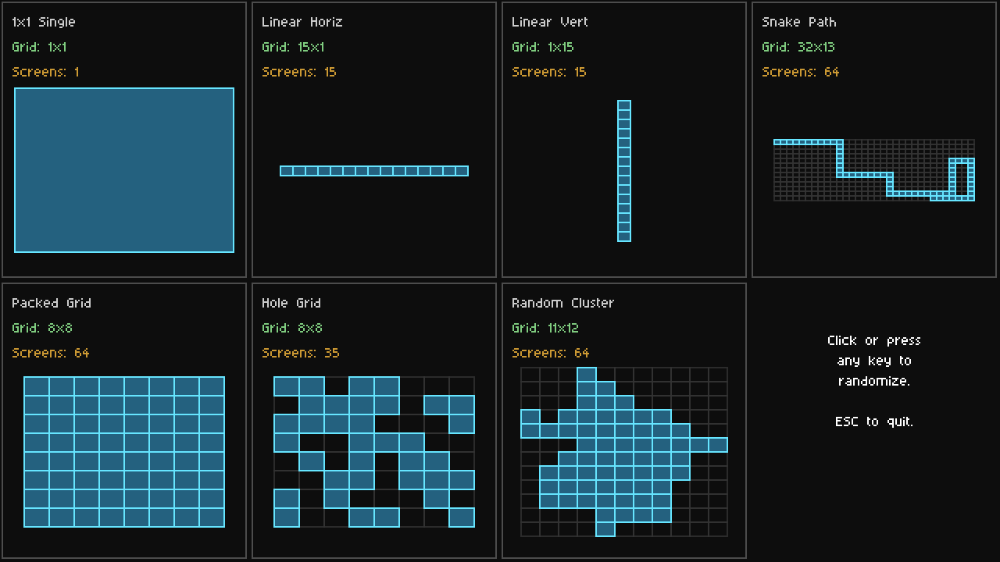

# Worlds and screens

How a Retr01 cart lays out maps. Graphics timing, pattern banks, palettes, and live VRAM are in [02_graphics_and_cartridge.md](02_graphics_and_cartridge.md). The MAP port wiring is in [08_memory_map.md](08_memory_map.md).

A **world** is a cart chapter: 4 CHR banks plus a sparse atlas of screens. A cart has up to **8** worlds (0-7). `$FE30` world select picks which chapter's CHR the PPU is drawing. Software `world` in RAM should match when you change chapter.

A **screen** is one **32x30** nametable plus packed attrs (1200 bytes uncompressed). It has a **(col, row)** on that world's virtual grid. Only stored screens occupy MAP bytes. Most screens are **playfield** (you walk them). A world may also store **parallax** cells (repeating strips, not enterable). Camera axis is H, V, or both (`set_camera_axis`). A plane forces H or V. See [02_graphics_and_cartridge.md](02_graphics_and_cartridge.md) section 8.

The **virtual grid** is up to **16 x 16** cells. At most **64** cells hold a real screen. The rest are holes. Holes are not stored. Connectivity is optional: a world may be a packed rectangle, a corridor, a blob, several islands, or a single room.

Hardware has no map camera. RAM holds `world`, `map_x`, `map_y` (one byte each). Set those and call `load_screen`. Pixel scroll is `scroll_x` / `scroll_y` over the live 1/2/4 nametable slots in VRAM.

## Caps (locked)

| Cap | Value |
|-----|-------|
| Worlds per cart | **8** (0-7) |
| Virtual grid | up to **16 x 16** |
| Stored screens per world | **64** max |
| Stored screens per cart | **512** max |
| Screen size | **32x30** tiles (256x240 px) |
| Live nametables in VRAM | up to **4** (2x2 field) |
| `map_x`, `map_y` | one byte each, **0-15** used, 16-255 invalid |

RAM is three separate bytes: `world` (0-7), `map_x` (0-15), `map_y` (0-15). World count stays **8**. The 16x16 grid is why X and Y each get their own byte, not a pair of nibbles.

CHR: **4 banks per world**, each 256 BG + 256 sprite patterns. That stays in [02_graphics_and_cartridge.md](02_graphics_and_cartridge.md).

## Example layouts

These are **examples**, not an enum. Any set of at most 64 cells on the 16x16 grid is legal. The screenshot is one roll of [`world_examples_generator/`](../world_examples_generator/). Grid sizes and screen counts change when you randomize.



*Image: `images/world_layouts.png`. Replace this file if you recapture the visualizer.*

The visualizer currently draws **seven** shapes. You can invent more (ring, two hubs plus a corridor, checker, four isolated rooms, a plus, a donut of holes, ...).

| Example | This shot | What it proves |
|---------|-----------|----------------|
| **1x1 Single** | grid 1x1, 1 screen | Isolated room. H or V parallax OK. Camera has nowhere to go anyway. |
| **Linear Horiz** | grid 14x1, 14 screens | Side scroller. Natural fit for **H** parallax (X camera). |
| **Linear Vert** | grid 1x13, 13 screens | Tower. Natural fit for **V** parallax (Y camera). |
| **Snake Path** | grid 16x16, 64 screens | 2D path. Parallax OK **per stretch**: H while you only pixel-scroll east-west, then `clear_parallax` at a corner. |
| **Packed Grid** | grid 8x8, 64 screens | 2D. Parallax OK on a vista row/col. No 2-axis pixel-scroll until `clear_parallax`. |
| **Hole Grid** | grid 8x8, 39 screens | Same camera rule as packed. |
| **Random Cluster** | grid 10x14, 64 screens | Same camera rule as packed. |

Blue cells are stored screens. Dark cells are holes (or past `grid_w` x `grid_h`). The PPU never sees this diagram. It only sees the live VRAM slots.

**Neighbors are 4-way** (N/E/S/W). Diagonals are not seam partners. Two screens that only touch on a corner are not adjacent for streaming.

## Empty neighbors and scroll

Pixel-scroll is **always** allowed, even if the current screen has 4, 3, 2, 1, or **zero** stored neighbors. The live 2x2 VRAM field still gets a nametable in the incoming slot:

- Directory **hit** on a **playfield** cell: decompress that screen.
- Directory **hit** on a **parallax** cell: treat as a miss for the camera (empty template). You cannot walk, warp, or seam-stream into it. `set_parallax` is the only loader that uses that payload.
- Directory **miss** (in-grid hole, or a neighbor past `grid_w`/`grid_h`): fill the slot with the world's **empty template**.
- Default empty template: **solid black** (tile 0 / backdrop). No extra MAP bytes.
- Optional later: one per-world empty nametable (rocks, mountains, void art). Stored **once** in that world's MAP (`empty_off`). Not once per hole.

The player should not walk into empty. That is **collision in PRG**, not a camera lock.

Warps (`load_screen` to a new col/row) are for doors and teleports. They are not required just because a screen is isolated.

**Streaming cue (software, not a PPU register):** when the camera is within **2 tiles (16 px)** of a seam, look up neighbor `(map_x±1, map_y)` or `(map_x, map_y±1)`. Hit: decompress into the incoming slot. Miss: empty template.

**Out-of-grid debug:** if `load_screen` is given coords outside 0-15, software may paint a lettered **EMPTY** pattern so the bug is obvious. That is not the same as an in-world hole (black / mountains).

## Where the atlas lives

| Place | Holds | Does not hold |
|-------|-------|----------------|
| **MAP-ROM** | World headers, screen directory, compressed screens | Game logic |
| **PRG** | `load_screen`, `set_parallax`, seam-stream. Tiny table of MAP base offsets if you want labels in ASM | The nametable pixels |
| **System RAM** | `world`, `map_x`, `map_y`. Optional cached copy of the current world's directory | |
| **VRAM** | Camera slots 0-3, plus plane slots 4-5 if parallax is on | The sparse world atlas (16x16 grid) |

```
Cartridge
+-- World 0..7
    +-- Pattern banks 0..3
    |     bank: BG patterns (256) + sprite patterns (256) = 512
    +-- Virtual grid up to 16 x 16 (sparse)
          +-- at most 64 stored nametables: playfield + optional linear parallax cells
```

## MAP-ROM layout (planning)

Do **not** store a 16x16 pointer matrix (that would be ~4 KB of mostly zeros per world). Store a **compact directory** of the screens that exist (max 64 rows).

```
MAP-ROM
+-- cart header
|     magic, version, world_count
|     world_base[8]: 24-bit offset to each world (0 = unused)
+-- world N
      grid_w, grid_h          ; 1..64 each
      screen_count            ; 1..64
      empty_off               ; 24-bit MAP offset to optional empty nametable, 0 = solid black
      directory[screen_count]:
          col, row            ; position on the virtual grid
          flags               ; 0 = playfield, 1 = parallax (not enterable)
          data_off            ; 24-bit MAP offset to payload
      payloads...
          optional copy of col, row (self-describing)
          RLE tile section (960 bytes uncompressed)
          RLE attr section (240 bytes uncompressed)
          ; decoded total = 1200 bytes per screen
```

Authoring sketch (assembled **into MAP**, not into PRG). Labels are for the map build. The 6502 never JMPs here.

```
world_01:
    .byte 12, 8     ; virtual grid 12 cols x 8 rows
    .byte 15        ; 15 real screens (the rest of 12x8 is empty)
    .byte 0, 0, 0   ; empty_off = 0 (solid black)
    ; directory: col, row, flags, then 24-bit data_off (macro from includes)

    .incbin "hub.bin"     ; playfield: optional col,row,flags + RLE×2 → 1200 bytes
    .incbin "cave.bin"
    .incbin "sky_a.bin"   ; flags=1. H span=2 with sky_b, not enterable
    .incbin "sky_b.bin"
```

### `load_screen`

1. Seek `$FE90` to `world_base[world]`, read `grid_w`, `grid_h`, `screen_count`, `empty_off`.
2. Scan the directory for `(map_x, map_y)`. At 8 MHz, 64 rows is cheap. You may cache the directory in system RAM on world enter (~64 * 6 bytes).
3. On miss, or on hit with **parallax** flag: fill the VRAM **camera** slot with the empty template (`empty_off == 0` = solid black, else that nametable). Do not use a parallax cell as a room.
4. On playfield hit: seek to `data_off`, RLE-decode tile section (960 bytes) then attr section (240 bytes), write **1200 bytes** into a camera nametable through `$FE1x`.
5. Coords outside 0-15: optional lettered EMPTY debug fill.

Seam fill is the same lookup. A parallax neighbor is a miss (empty / blocked). `set_parallax` is a separate call: same directory lookup, but it decompresses into plane slot 4 or 5. See [02_graphics_and_cartridge.md](02_graphics_and_cartridge.md) section 8.

How to poke `$FE90` (24-bit address, auto-inc read): [08_memory_map.md](08_memory_map.md).

### Why 24-bit offsets

MAP-ROM is up to **~1.17 MB**. A 16-bit absolute address only covers 64 KB, so it cannot point at the whole MAP. `$FE90` is already a 24-bit seek, so `world_base`, `empty_off`, and `data_off` are the same width: poke the three bytes and read. The extra byte vs 16-bit is 64 directory rows * 1 = 64 bytes per world. Directory row is 6 bytes (`col`, `row`, `flags`, 24-bit `data_off`).

A 16-bit **world-relative** `data_off` would work only if each world's MAP blob stays under 64 KB. Uncompressed, 64 screens * 1200 bytes is already 76.8 KB, so that cap forces compression and a hard per-world limit. Not worth it. Keep 24-bit.
