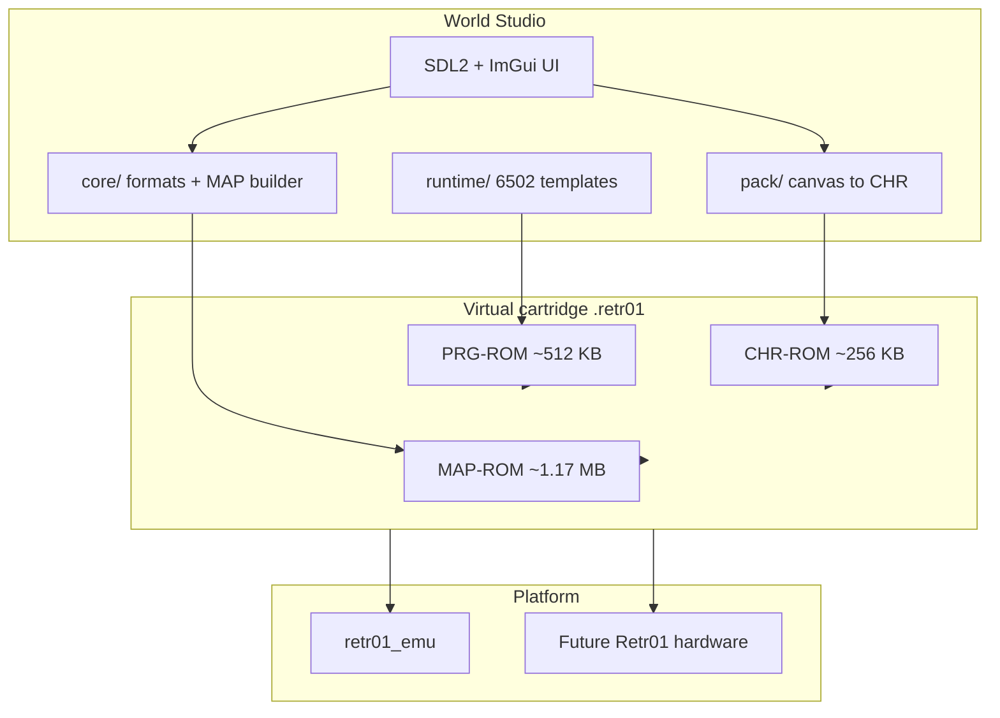

# 01 — Overview

## What World Studio is

Retr01 World Studio is a **visual authoring application** for the Retr01 8-bit arcade platform. It lets you:

1. Paint **32×30** nametables (256×240 px) with per-tile palette selection
2. Lay out **sparse world atlases** on a up-to-64×64 grid (max 64 stored screens per world)
3. Assign **CHR pattern banks** (256 BG + 256 sprite tiles per bank, 4 banks per world)
4. Configure **parallax cells**, camera axis, and **world-mode packs** (platformer, top-down, etc.)
5. **Build** a runnable `.retr01` virtual cartridge and preview it in `retr01_emu`

v1 is **not** a full game engine in a box. World-mode packs ship **6502 engine stubs** (movement, scroll, seam fill, fade) plus **project-generated init data**. Game logic beyond the stub remains user PRG in later versions.

## What v1 delivers

| In scope | Out of scope (v1) |
|----------|-------------------|
| Full cart export: PRG + CHR + MAP | Custom user 6502 beyond pack hooks |
| Five world-mode packs (see [04_world_mode_packs.md](04_world_mode_packs.md)) | Arbitrary axis Cartesian product (every combo of movement × physics × camera) |
| Screen painter, world grid, palette editor | Hardware flash programming |
| Live preview with pack movement stub | Multiplayer netplay |
| `.r01proj` project save/load | NES `.nam` / PPUX 1024-byte export |

## Why not PPUX directly

[PPUX](https://github.com/igwgames/ppux) (reference repo at `/home/g/Repos/ppux/`) is NES-centric:

- Sketch canvas exports **1024-byte** nametables (960 tiles + **64** NES attribute bytes)
- Retr01 needs **1200 bytes** per screen (960 tiles + **240** per-tile packed attrs)
- PPUX has no world grid, MAP atlas, parallax metadata, or Retr01 camera API

**Reuse from PPUX (patterns, not a fork):**

- Window/link model (CHR/palette source → screen consumer)
- [`ppux_sketch.c`](file:///home/g/Repos/ppux/native/ppux_sketch/ppux_sketch.c): 256×240 → unique 8×8 tiles, tolerance pack, flood fill — adapt attr packing for Retr01
- Gallery ROM idea → Retr01 pack ROM built from project + selected world mode

## Relationship to hardware spec

World Studio is a **producer** of cart contents defined in `markdown_v_01/`:



The tool must stay faithful to locked caps in [04_worlds_and_screens.md](../markdown_v_01/04_worlds_and_screens.md): 8 worlds, 64 screens/world, 512 screens/cart, 24-bit MAP offsets, directory `flags` for parallax.

## Proposed repo layout

New top-level folder inside the `retr01` repository:

```text
retr01_world_studio/
  planning/          ← these docs
  core/              # C: RLE, MAP/CHR builders, .r01proj I/O, validation
  pack/              # C: canvas → tiles → CHR, attr plane, dedupe
  runtime/           # 6502/asm templates + pack manifests (cc65)
    packs/
      side_platformer/
      topdown_8way/
      single_screen/
      vertical_climb/
      paddle_2way/
    generated/       # build output: world_init.s, config tables (gitignored)
  app/               # SDL2 + Dear ImGui UI
  third_party/       # imgui, optional stb
  build/             # output: <project>.retr01 (gitignored)
```

`retr01_emu/` may live as a sibling directory or submodule; preview links against shared `core/` format code where possible.

## Prerequisites before coding export

1. **B9 MAP RLE** — canonical byte codec (recommendation: length-prefixed runs + literal blocks; tile plane then raw 240-byte attrs). Studio implements it; emulator shares the same decoder. See [06_data_formats.md](06_data_formats.md).
2. **Master palette** — v1 loads [`retr01_palette_v_01.txt`](../retr01_palette_v_01.txt) (64 RGB entries). See [09_master_palette.md](09_master_palette.md). Editable in-app; embedded in `.r01proj`.

No silicon blockers remain for an MVP.

## Success criteria (v1)

- Open `.r01proj`, paint a 2×2 world, pick `side_platformer`, build → `my_game.retr01`
- `retr01_emu` loads cart, player moves with 4/8-way input, horizontal camera scrolls, seam fill at east edge works
- Parallax cell: `set_parallax` metadata from editor; camera forced to H or V while plane active
- CHR overflow and MAP size warnings before build fails loudly

## Related docs

- UI details: [02_ui.md](02_ui.md)
- ASM generation: [04_world_mode_packs.md](04_world_mode_packs.md)
- Cart binary: [05_cart_assembly.md](05_cart_assembly.md)
- Phases: [07_build_pipeline.md](07_build_pipeline.md)
