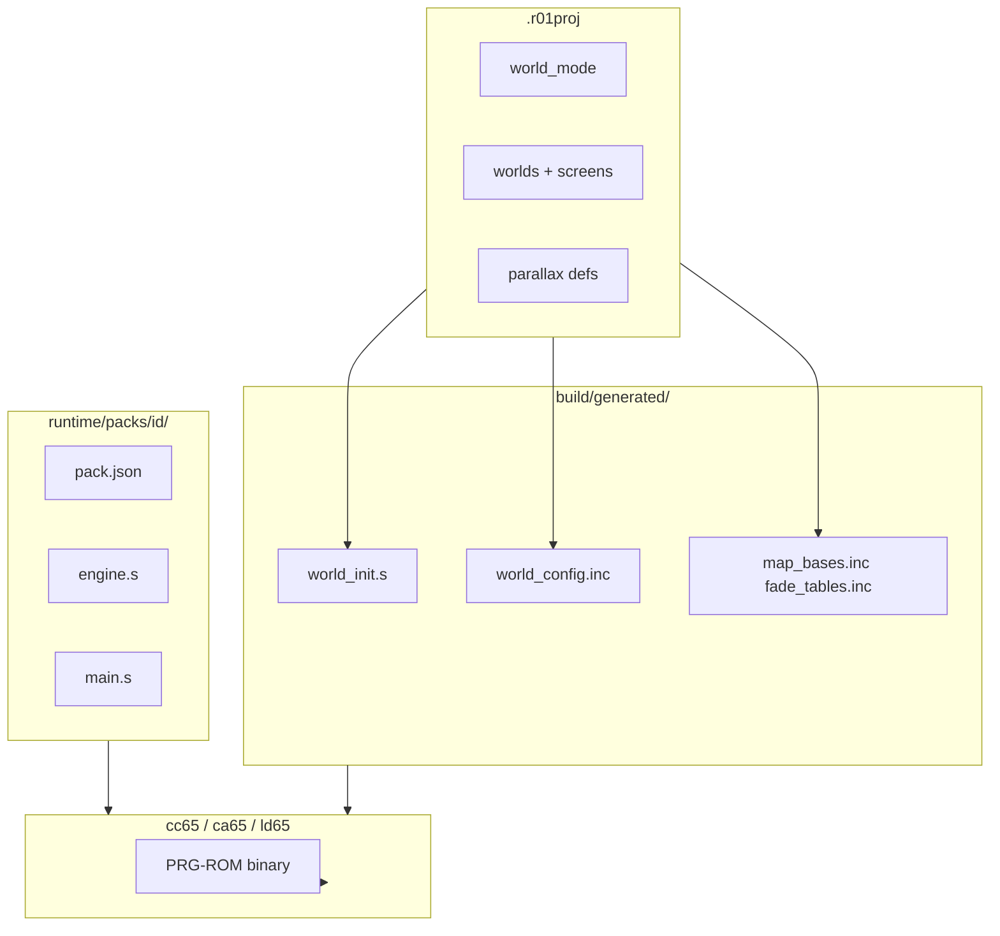

# 04 — World-mode packs and ASM generation

World-mode packs are **named presets** that combine runtime behavior axes with **6502 PRG templates**. The studio does not generate arbitrary game logic; it **selects a pack**, applies **project overrides**, and **emits data tables + init code** that link into the pack's engine.

## Architecture



**Fixed at pack authoring time:** NMI loop structure, input read, seam-stream algorithm, physics step, fade step, calls to `set_camera_axis` / `set_parallax` / `load_screen`.

**Generated per project:** start coords, MAP base label table, parallax init sequence, screen link warps, baked fade palette ramps, `WorldModeConfig` byte struct in PRG RAM.

## Runtime axes

Orthogonal dimensions composed into packs:

| Axis | Values | PRG responsibility |
|------|--------|-------------------|
| **Movement** | `DIR2`, `DIR4`, `DIR8` | Input mask → velocity |
| **Transition** | `SMOOTH`, `INSTANT`, `FADE` | Seam scroll vs warp vs palette lerp |
| **Physics** | `PLATFORM`, `TOPDOWN`, `FIXED` | Gravity, ground test, or locked paddle |
| **Camera** | `CAM_H`, `CAM_V`, `CAM_BOTH` | Which scroll regs follow player |
| **Parallax** | optional | From world metadata → `set_parallax` calls |

v1 ships **five fixed packs**, not a Cartesian product of all axis values.

## Pack directory layout

```text
runtime/packs/<pack_id>/
  pack.json       # defaults, cc65 flags, required features
  engine.s        # shared routines (included by all packs)
  main.s          # reset, NMI, main loop skeleton
  physics_<type>.s   # optional include
  scroll_<type>.s    # optional include
```

### `pack.json` example

```json
{
  "id": "side_platformer",
  "label": "Side-scroller platformer",
  "defaults": {
    "movement": "DIR4",
    "transition": "SMOOTH",
    "physics": "PLATFORM",
    "camera": "CAM_H"
  },
  "allowed_overrides": {
    "movement": ["DIR4", "DIR8"],
    "transition": ["SMOOTH", "FADE"],
    "physics": ["PLATFORM"],
    "camera": ["CAM_H"]
  },
  "features": {
    "seam_stream": true,
    "raster_irq": false,
    "fade_tables": true
  },
  "cc65": {
    "memory_model": "retr01.cfg",
    "defines": ["PACK_SIDE_PLATFORMER"]
  }
}
```

## v1 pack catalog

| Pack ID | Label | Movement | Transition | Physics | Camera | Use case |
|---------|-------|----------|------------|---------|--------|----------|
| `side_platformer` | Side-scroller | 4 or 8 | SMOOTH (+ FADE at links) | PLATFORM | CAM_H | SMB / Contra horizontal |
| `topdown_8way` | Top-down | 8 | SMOOTH | TOPDOWN | CAM_BOTH | Zelda-like (no parallax) |
| `single_screen` | Single room | 8 | INSTANT | TOPDOWN | CAM_BOTH | Puzzle / RPG room |
| `vertical_climb` | Vertical platformer | 4 | SMOOTH | PLATFORM | CAM_V | Tower / pit |
| `paddle_2way` | Paddle / breakout | 2 | FIXED | FIXED | CAM_BOTH | Arkanoid |

## ASM generation pipeline

### Step 1 — Emit `world_config.inc`

Generator reads `world_mode` and writes ca65 `.define` or `.struct` constants:

```asm
; build/generated/world_config.inc — GENERATED, do not edit
PACK_ID = 1                    ; side_platformer enum
MOVEMENT = MOVEMENT_DIR8
TRANSITION = TRANSITION_SMOOTH
PHYSICS = PHYSICS_PLATFORM
CAMERA = CAMERA_H
START_WORLD = 0
START_COL = 0
START_ROW = 0
```

Shared enums live in `runtime/include/world_mode.inc`.

### Step 2 — Emit `map_bases.inc`

Optional PRG table of 24-bit MAP world base offsets (for debug labels or fast world switch):

```asm
; build/generated/map_bases.inc
world_base_0: .byte $12, $34, $56   ; 24-bit little-endian MAP offset
world_base_1: .byte $00, $00, $00   ; unused world
```

Most lookup happens via `$FE90` at runtime; this table is for init and debugging.

### Step 3 — Emit `world_init.s`

Project-specific boot sequence:

```asm
; build/generated/world_init.s — GENERATED
.proc world_init
    lda #START_WORLD
    sta world
    lda #START_COL
    sta map_x
    lda #START_ROW
    sta map_y
    jsr load_screen

    ; Parallax from .r01proj parallax[] (world 0 example)
    lda #80
    jsr set_parallax_height
    lda #0          ; par_col
    ldx #0          ; par_row (sky row)
    ; ... push axis, drive, factor, span ...
    jsr set_parallax

    lda #CAMERA
    jsr set_camera_axis
    rts
.endproc
```

Generator walks `worlds[].parallax` and emits one `set_parallax` block per entry (v1: **one active plane** per spec — warn if multiple).

### Step 4 — Emit `fade_tables.inc` (FADE transition)

When project links use `FADE`, tool **precomputes** palette lerp tables at build time (PPUX gallery pattern):

```asm
; build/generated/fade_tables.inc
fade_link_0:
    .byte $00, $01, $02, ...   ; 32 frames × palette bytes
fade_link_0_len = 32
```

Runtime: on warp trigger, NMI or main loop steps through table — no 6502 palette math in v1.

### Step 5 — Emit `screen_links.inc` (optional warps)

For INSTANT/FADE doors not aligned to grid seam:

```asm
; build/generated/screen_links.inc
link_count = 2
link_from_col: .byte 5, 3
link_from_row: .byte 2, 2
link_from_edge: .byte EDGE_E, EDGE_N
link_to_col:   .byte 6, 3
link_to_row:   .byte 2, 0
link_transition: .byte TRANSITION_FADE, TRANSITION_INSTANT
```

Engine checks player position against link rects each frame.

### Step 6 — Assemble with cc65

Linker script `runtime/cfg/retr01.cfg` places:

- Pack `engine.s` + `main.s` in PRG-ROM
- Generated includes in same bank
- `world_init` called from `main` after hardware init

Output: `build/intermediate/prg.bin` slice (see [05_cart_assembly.md](05_cart_assembly.md)).

## Per-pack behavior (implementation notes)

### `side_platformer`

| Module | Behavior |
|--------|----------|
| Input | 4-way or 8-way; horizontal velocity dominant |
| Physics | Gravity, ground AABB from optional collision grid |
| Camera | `scroll_x` follows player; `scroll_y` fixed or clamped |
| Seam | East/west: 2-tile cue, decompress neighbor into slot 1/2 |
| Parallax | If present, `CAM_H` forced; vertical scroll frozen for playfield band |

### `topdown_8way`

| Module | Behavior |
|--------|----------|
| Input | 8-way velocity |
| Physics | No gravity; free plane |
| Camera | `CAM_BOTH`; 2×2 VRAM field when near corners |
| Seam | Both axes; seam-stream per [04 spec](../markdown_v_01/04_worlds_and_screens.md) |
| Parallax | Allowed but forces H or V — warn in editor for diagonal paths |

### `single_screen`

| Module | Behavior |
|--------|----------|
| Input | 8-way within room |
| Transition | INSTANT only (no seam stream) |
| Camera | Fixed; scroll regs center room or zero |
| MAP | One screen; directory size 1 |

### `vertical_climb`

| Module | Behavior |
|--------|----------|
| Camera | `CAM_V` |
| Seam | North/south neighbors |
| Physics | Platform jump; pit death stub optional |

### `paddle_2way`

| Module | Behavior |
|--------|----------|
| Input | DIR2 horizontal |
| Physics | FIXED — paddle Y locked |
| Camera | No scroll; single screen typical |
| Transition | FIXED — no world change |

## Shared engine routines (`engine.s`)

All packs include:

| Symbol | Role |
|--------|------|
| `read_input` | Map `$FE60` → stick + buttons |
| `load_screen` | PRG helper per [04](../markdown_v_01/04_worlds_and_screens.md) |
| `seam_stream` | 2-tile margin neighbor fill |
| `set_camera_axis` | `$FE0x` or RAM mirror per spec |
| `set_parallax` / `clear_parallax` | Plane slots 4–5 |
| `fade_step` | Advance baked fade table |
| `nmi_handler` | Frame tick, OAM DMA stub |

Guest symbols are **not** emulator syscalls — they are linked PRG code using `$FE90` MAP port and VRAM writes per [08](../markdown_v_01/08_memory_map.md).

## Validation (pack linter)

Run from UI **Lint** or pre-build:

| Rule | Severity |
|------|----------|
| Override not in `allowed_overrides` | Error |
| `CAM_BOTH` + active parallax in same world | Warning (runtime forces axis) |
| `SMOOTH` + `single_screen` pack | Error |
| `FADE` without generated fade table | Error |
| Start cell is parallax `flags=1` | Error |
| Missing screen referenced by parallax span | Error |

## Future: user PRG extension (post-v1)

Hook table in pack:

```asm
; user_hook_after_init: optional weak symbol
```

Studio builds stub only; advanced users replace `user/` object file. Not v1 scope.

## Related docs

- Project fields consumed: [03_project_format.md](03_project_format.md)
- PRG placement in cart: [05_cart_assembly.md](05_cart_assembly.md)
- Build order: [07_build_pipeline.md](07_build_pipeline.md)
