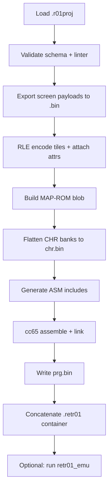

# 05 — Cart assembly (`.retr01` binary)

World Studio's primary deliverable is a **full virtual cartridge** file with extension **`.retr01`**. It contains PRG-ROM, CHR-ROM, and MAP-ROM in one loadable image for `retr01_emu` and future hardware flash.

Example: `load_cart("build/my_game.retr01")` as in [`07_emulator_specification.md`](../markdown_v_01/07_emulator_specification.md).

## What gets assembled

| Region | Source | Budget (planning) |
|--------|--------|-------------------|
| **PRG-ROM** | cc65 output from world-mode pack + generated ASM | ~512 KB |
| **CHR-ROM** | `pack/` + `.r01proj` CHR banks | ~256 KB |
| **MAP-ROM** | `core/` MAP builder (directory + RLE payloads) | ~1.17 MB |
| **Total** | | ~2 MB parallel flash |

Uncompressed MAP upper bound: `8 × 64 × (960 + 240) = 600 KB` before RLE — see [02_graphics](../markdown_v_01/02_graphics_and_cartridge.md) section 7.

## Container format (`.retr01`)

Planning layout — to be mirrored in `markdown_v_01` when Phase 0 lands:

```
Offset   Size     Field
------   ----     -----
0x0000   6        Magic: 'R' 'E' 'T' 'R' '0' '1'  (0x52 0x45 0x54 0x52 0x30 0x31)
0x0006   2        Format version (uint16 LE) = 1
0x0008   1        Flags (reserved)
0x0009   1        World count (1–8, active worlds in MAP)
0x000A   4        PRG size bytes (uint32 LE)
0x000E   4        CHR size bytes (uint32 LE)
0x0012   4        MAP size bytes (uint32 LE)
0x0016   4        PRG load address or file offset (uint32 LE) — TBD with linker
0x001A   22       Reserved / checksum placeholder
0x0030   prg_size PRG-ROM data
+prg     chr_size CHR-ROM data
+chr     map_size MAP-ROM data
```

**Design notes:**

- Six-byte magic spells **RETR01** — distinct from iNES (`NES` + 0x1A), WinRAR `.r01` split archives, and foreign dumps
- Three size fields support mmap-style loading in emulator
- Optional CRC32 in reserved bytes (v1.1) — v1 may skip checksum
- No split-archive semantics; one file = one cart

Alternative considered and rejected: `.retr01.bin` double extension (redundant); `.cart` (Atari 800 `.CAR` collision).

## MAP-ROM internal layout

Built by `core/map_builder.c` from `.r01proj`. Matches [04_worlds_and_screens.md](../markdown_v_01/04_worlds_and_screens.md):

```
MAP-ROM
+-- cart MAP header (may duplicate or extend .retr01 header slice)
|     magic, version, world_count
|     world_base[8]: 24-bit offset each (0 = unused)
+-- world N
      grid_w, grid_h
      screen_count
      empty_off (24-bit)
      directory[screen_count]:
          col, row, flags, data_off (24-bit)
      payloads[]
          [optional col, row header in payload]
          RLE tile plane (960 bytes uncompressed)
          raw attr plane (240 bytes)
```

Directory row: **6 bytes** (`col`, `row`, `flags`, 24-bit `data_off`).

24-bit offsets required because MAP-ROM spans ~1.17 MB — 16-bit absolute offsets insufficient.

## CHR-ROM layout

Linear concatenation per world:

```
World 0: bank0 BG (256×16) + bank0 sprite (256×16)
         bank1 ...
         bank2 ...
         bank3 ...
World 1: ...
...
```

Each tile = **16 bytes** (2bpp 8×8). Total per world: `4 × 512 × 16 = 32,768` bytes (32 KB) if fully populated.

Builder assigns file offsets; `$FE30` world select at runtime picks active bank — see [02](../markdown_v_01/02_graphics_and_cartridge.md).

## PRG-ROM layout

Produced by cc65:

```text
runtime/cfg/retr01.cfg   → memory regions
runtime/packs/<id>/main.s
runtime/packs/<id>/engine.s
build/generated/world_init.s
build/generated/world_config.inc
build/generated/map_bases.inc
build/generated/fade_tables.inc (if needed)
```

Entry: reset vector at `$FFFC` → init hardware → `jsr world_init` → main loop / NMI.

PRG must include **MAP loader helpers** (`load_screen`, seam fill) or link against `runtime/engine/` static library — same symbols documented in hardware spec as guest PRG, not BIOS.

## Assembly pipeline (ordered steps)



### Step detail

1. **Validate** — errors block build (see [03_project_format.md](03_project_format.md))
2. **Screen `.bin`** — per payload: optional `(col, row, flags)` + RLE + 240 attr bytes
3. **MAP builder** — assign `world_base[]`, `data_off`, pack directory
4. **CHR flatten** — dedupe already done at Generate time in editor
5. **ASM gen** — [04_world_mode_packs.md](04_world_mode_packs.md)
6. **cc65** — `ca65` all `.s`, `ld65` with `retr01.cfg` → `prg.bin`
7. **Container write** — `core/cart_writer.c`:

```c
/* Pseudocode */
write_magic(out, "RETR01");  /* 0x52, 0x45, 0x54, 0x52, 0x30, 0x31 */
write_u16(out, 1);  /* format version */
write_u32(out, prg_size);
write_u32(out, chr_size);
write_u32(out, map_size);
write_blob(out, prg, prg_size);
write_blob(out, chr, chr_size);
write_blob(out, map, map_size);
```

8. **Output path** — `build/<output_name>.retr01` from project `build.output_name`

## Intermediate artifacts

`build/intermediate/` (gitignored):

| File | Purpose |
|------|---------|
| `screens/*.bin` | Self-describing MAP payloads |
| `map.bin` | Raw MAP-ROM |
| `chr.bin` | Raw CHR-ROM |
| `prg.bin` | Raw PRG-ROM |
| `build.log` | Sizes, warnings, cc65 output |

Keep intermediates on failed build for debugging.

## Size checks before write

| Check | Limit | On exceed |
|-------|-------|-----------|
| PRG size | 512 KB | Error |
| CHR size | 256 KB | Error |
| MAP size | 1.17 MB | Error |
| Screens per world | 64 | Error (validation) |
| Total screens | 512 | Error |

Show **estimate** in Build dialog before running cc65 (MAP size from RLE dry-run).

## Emulator load contract

`retr01_emu` `load_cart()`:

1. Verify magic + version
2. Map PRG into CPU address space per emulator spec
3. Load CHR into PPU pattern fetch path
4. Attach MAP blob to `$FE90` backend
5. Reset CPU; PC from `$FFFC`

Emulator and studio **share** `core/rle.c`, `core/map_read.c` where possible — single decoder for B9.

## Hardware flash (future)

Same `.retr01` image may be stripped or relocated for physical 2 MB flash programmer. Studio does not drive programmer in v1; container offsets documented for tooling later.

## Related docs

- RLE and screen bytes: [06_data_formats.md](06_data_formats.md)
- ASM generation: [04_world_mode_packs.md](04_world_mode_packs.md)
- Phase ownership: [07_build_pipeline.md](07_build_pipeline.md)
