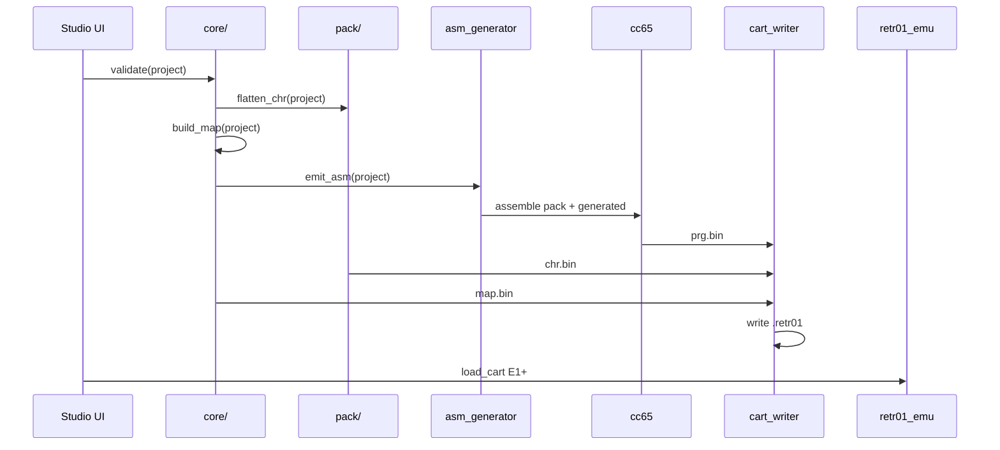

# 07 — Build pipeline and implementation phases

End-to-end flow from edited project to playable `.retr01`, plus phased delivery plan.

**Emulator timing:** the minimal emulator (**E0**) is **simpler than World Studio** and should start **immediately after Phase 0** (shared `core/`). See [10_emulator_development.md](10_emulator_development.md) for layers E0 → E1 → E2 and gating rules.

**Testing:** add **unit and integration tests with each feature** — same step, same PR. Policy: [11_testing_policy.md](11_testing_policy.md). No phase is complete until its tests pass.

## Toolchain dependencies

| Tool | Version | Role |
|------|---------|------|
| C compiler | C11 | `core/`, `pack/`, `app/`, `retr01_emu/` |
| SDL2 | 2.x | Studio window + **emulator display (E0+)** |
| Dear ImGui | docking | Studio UI only |
| cc65 | recent | 6502 assemble/link PRG (Phase 3) |
| Python 3 | optional | CI scripts |
| **CTest** / test runner | — | **`ctest` after every build; tests added per [11_testing_policy.md](11_testing_policy.md)** |
| `retr01_emu` | sibling dir | **Required from E0** — format verification, then runnable carts |

## Master checklist (Studio + emulator)

| Step | Owner | Goal | Gate |
|------|-------|------|------|
| **0** | `core/` | RLE, MAP, `.retr01`, palette | **`ctest` green** (unit + integration) |
| **E0** | `retr01_emu/` | PPU viewer: 1 screen, no CPU | E0 tests + fixture golden; **then** start Phase 1 |
| **1** | Studio `app/` | Screen Painter + CHR | Export viewable in E0 |
| **2** | Studio | World grid + MAP export | E0 loads any directory cell |
| **E1** | `retr01_emu/` | CPU + bus + `$FE60` input | **Required before Phase 3 Build ships** |
| **3** | Studio `runtime/` | Packs + cc65 + Build dialog | E1 runs built `.retr01` |
| **E2** | `retr01_emu/` | Parallax, IRQ, OAM, APU | Required for Phase 4 embed |
| **4** | Studio + emu | Live preview, polish | Edit → preview loop |

```mermaid
gantt
  title Delivery order
  dateFormat X
  axisFormat %s
  section Core
  Phase 0 core           :0, 2
  section Emulator
  E0 PPU viewer          :2, 3
  E1 CPU plus cart       :6, 9
  E2 spec fidelity       :10, 14
  section Studio
  Phase 1 Screen Painter :3, 6
  Phase 2 World grid     :5, 7
  Phase 3 PRG packs      :9, 12
  Phase 4 Preview        :12, 16
```



(Timeline is relative weeks, not calendar dates.)

## Build commands (target UX)

From project root:

```bash
# Shared core + emulator (E0+)
cmake -B build -S .   # top-level or super-project TBD
cmake --build build
./build/retr01_emu --cart fixtures/one_screen.retr01 --world 0 --col 0 --row 0

# Studio (after Phase 1)
./build/retr01_studio my_game.r01proj

# Headless cart build + test (Phase 3+)
./build/retr01_studio --build my_game.r01proj -o build/my_game.retr01
./build/retr01_emu --headless --cart build/my_game.retr01 --frames 600
```

## Pipeline stages (cart build)



| Stage | Input | Output | Owner |
|-------|-------|--------|-------|
| Validate | `.r01proj` | error list | `core/validate.c` |
| CHR flatten | project CHR | `chr.bin` | `pack/chr_flatten.c` |
| MAP build | screens + worlds | `map.bin` | `core/map_builder.c` |
| ASM generate | world_mode + worlds | `build/generated/*` | `core/asm_gen.c` |
| cc65 | `.s` + `.cfg` | `prg.bin` | external |
| Cart write | prg + chr + map | `.retr01` | `core/cart_writer.c` |
| Verify | `.retr01` | framebuffer / exit code | **`retr01_emu` (E0 static, E1+ run)** |

---

## Phase 0 — Shared formats (1–2 weeks)

**Goal:** `core/` testable without UI or CPU. **Prerequisite for both Studio and E0.**

- [ ] `retr01_screen_t`, attr helpers
- [ ] RLE encode/decode — **B9 locked:** 960 tile + 240 attr bytes ([06_data_formats.md](06_data_formats.md))
- [ ] MAP builder: header, world blocks, 6-byte directory rows
- [ ] CHR 2bpp read/write
- [ ] `retr01_palette_load_v01()` — [`retr01_palette_v_01.txt`](../retr01_palette_v_01.txt)
- [ ] `.r01proj` schema + load/save + validate
- [ ] `cart_writer.c` + `cart_load.c` (`.retr01` RETR01 magic)
- [ ] Unit tests for each `core/` module ([11_testing_policy.md](11_testing_policy.md))
- [ ] `ctest` wired in CMake; fixture `fixtures/one_screen.retr01` (CHR + MAP, empty/minimal PRG)

**Exit:** `ctest` green; `one_screen.retr01` on disk for E0.

---

## Phase E0 — Minimal emulator: PPU viewer (~1 week)

**Goal:** SDL app that loads a cart and displays one MAP screen. **No 6502.**

- [ ] `retr01_emu/` skeleton + SDL host
- [ ] Link `libretr01_core` (cart load, RLE decode, palette)
- [ ] MAP directory lookup → decode 1200 bytes → VRAM slot 0
- [ ] PPU BG path: scroll regs (manual set OK), CHR fetch, attrs, master palette → framebuffer
- [ ] CLI: `--cart`, `--world`, `--col`, `--row`, optional `--dump-fb`
- [ ] **Tests:** MAP→VRAM 1200 B; pixel spot-check; golden framebuffer vs `test/golden/`

**Exit:** E0 tests pass; fixture screen matches golden.

**Gate:** Studio Phase 1 may start.

Details: [10_emulator_development.md](10_emulator_development.md).

---

## Phase 1 — Screen editor MVP (2–3 weeks)

**Goal:** Paint screens; verify in **E0** after each export.

- [ ] SDL2 + ImGui shell ([02_ui.md](02_ui.md))
- [ ] Screen Painter + CHR Generate
- [ ] Save/load `.r01proj`
- [ ] Export → `.retr01` or partial cart → **open in E0**
- [ ] **Tests:** `pack/chr_pack.c` unit tests (dedupe, 256 cap, attrs on toy canvas)

**Exit:** Painted screen in Studio == pixels in E0; pack tests green.

---

## Phase 2 — World grid + MAP export (1–2 weeks)

**Goal:** Multi-screen MAP; browse cells in E0.

- [ ] World Grid panel
- [ ] Parallax metadata in project (display still E0-static OK)
- [ ] Full MAP-ROM for one world
- [ ] E0: step through directory entries
- [ ] **Tests:** multi-screen MAP integration; parallax `flags=1` in directory

**Exit:** 2×2 world correct in E0; MAP integration tests green.

---

## Phase E1 — CPU + runnable PRG (2–3 weeks, overlaps Phase 2–3)

**Goal:** Run cc65 ROMs and Studio-built carts.

- [ ] 6502 core, bus decode, `system_ram`, `io_regs`
- [ ] PRG/CHR mapping, NMI loop
- [ ] Keyboard → `$FE60`; minimal test ROM
- [ ] `load_cart("*.retr01")` per [07_emulator_specification.md](../markdown_v_01/07_emulator_specification.md)
- [ ] Headless `--frames N` for CI
- [ ] **Tests:** bus/RAM bounds; tiny test ROM; headless smoke test

**Exit:** E1 tests pass; ready for Phase 3 gallery cart.

**Gate:** Phase 3 “Play in emulator” must use E1.

---

## Phase 3 — World-mode packs + PRG build (2–3 weeks)

**Goal:** Runnable `.retr01` with movement stub, verified in **E1**.

- [ ] Five packs, `asm_gen`, cc65, Build dialog
- [ ] CI: build fixture → E1 headless 600 frames
- [ ] **Tests:** `asm_gen` snapshot fixtures; pack linter cases; E2E build script

**Exit:** `side_platformer` cart scrolls in E1; E2E test in CI.

---

## Phase E2 — Emulator spec fidelity (ongoing)

**Goal:** Parallax, raster IRQ, OAM, APU — for hardware parity and Phase 4 embed.

- [ ] Planes 4–5, `$FE0x` raster
- [ ] Sprites + priority
- [ ] APU → SDL audio
- [ ] C API for Studio embed ([08_preview_and_testing.md](08_preview_and_testing.md))

**Exit:** preview matches standalone emu.

---

## Phase 4 — Live preview polish (ongoing)

**Goal:** Embed E2 in Studio; edit-test loop.

- [ ] Preview panel links `retr01_emu` library
- [ ] Hot reload CHR/MAP where safe
- [ ] Fade tables, collision export
- [ ] Doc → `markdown_v_01/13_world_studio.md`

---

## CI recommendations

```yaml
- cmake -B build -S . && cmake --build build
- ctest --test-dir build --output-on-failure    # unit + integration (required every CI run)
- build/retr01_emu --headless --cart retr01_world_studio/tests/fixtures/one_screen.retr01 --frames 60
# Phase 3+: studio --build fixtures/linear_h.r01proj → emu headless
```

See [11_testing_policy.md](11_testing_policy.md) for the full matrix.

---

## Risks and mitigations

| Risk | Mitigation |
|------|------------|
| Studio built without visual verify | **E0 gate** before Phase 1 |
| RLE decoder drift | Single `core/rle.c` linked by studio + emu |
| Emulator deferred too long | E0 is ~1 week; parallel to early Studio |
| Full emu scope blocks Studio | E0/E1 minimal; E2 deferred |
| cc65 on Windows | Docker / doc install |

---

## Documentation updates when coding starts

- [10_emulator_development.md](10_emulator_development.md) — living emulator plan
- B9 + palette locked in OPEN_QUESTIONS / [06_data_formats.md](06_data_formats.md), [09_master_palette.md](09_master_palette.md)
- Update [07_emulator_specification.md](../markdown_v_01/07_emulator_specification.md): E0/E1/E2 tiers, toolchain no longer “out of scope” for emu bootstrap

---

## Related docs

- Emulator layers: [10_emulator_development.md](10_emulator_development.md)
- UI: [02_ui.md](02_ui.md)
- Preview: [08_preview_and_testing.md](08_preview_and_testing.md)
