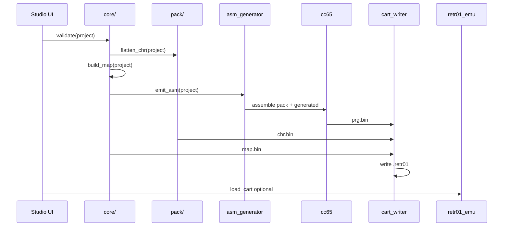

# 07 — Build pipeline and implementation phases

End-to-end flow from edited project to playable `.retr01`, plus phased delivery plan.

## Toolchain dependencies

| Tool | Version | Role |
|------|---------|------|
| C compiler | C11 | `core/`, `pack/`, `app/` |
| SDL2 | 2.x | Window, input, textures |
| Dear ImGui | docking | UI |
| cc65 | recent | 6502 assemble/link PRG |
| Python 3 | optional | CI scripts, golden-file tests |
| `retr01_emu` | sibling | Preview + shared format tests |

## Build commands (target UX)

From project root:

```bash
# Configure + build studio (CMake or Makefile TBD)
cmake -B build-studio -S retr01_world_studio
cmake --build build-studio

# Run studio
./build-studio/retr01_studio my_game.r01proj

# Headless build (CI / automation)
./build-studio/retr01_studio --build my_game.r01proj -o build/my_game.retr01
```

Headless mode skips UI; runs validate → assemble → write cart.

## Pipeline stages



| Stage | Input | Output | Owner |
|-------|-------|--------|-------|
| Validate | `.r01proj` | error list | `core/validate.c` |
| CHR flatten | project CHR | `chr.bin` | `pack/chr_flatten.c` |
| MAP build | screens + worlds | `map.bin` | `core/map_builder.c` |
| ASM generate | world_mode + worlds | `build/generated/*` | `core/asm_gen.c` |
| cc65 | `.s` + `.cfg` | `prg.bin` | external |
| Cart write | prg + chr + map | `.retr01` | `core/cart_writer.c` |

## Phase 0 — Formats and shared library (1–2 weeks)

**Goal:** `core/` and `pack/` testable without UI.

- [ ] `retr01_screen_t`, attr helpers
- [ ] RLE encode/decode — **close B9** in docs
- [ ] MAP builder: header, world blocks, 6-byte directory rows
- [ ] CHR 2bpp read/write
- [ ] `retr01_palette_load_v01()` — parse [`retr01_palette_v_01.txt`](../retr01_palette_v_01.txt)
- [ ] `.r01proj` schema + load/save + validate
- [ ] `cart_writer.c` with placeholder PRG
- [ ] Unit tests (see [06_data_formats.md](06_data_formats.md))

**Exit:** `tests/map_roundtrip` builds MAP from fixture JSON; emulator loads MAP stub.

## Phase 1 — Screen editor MVP (2–3 weeks)

**Goal:** Paint screens and export MAP payloads.

- [ ] SDL2 + ImGui shell, default dock layout ([02_ui.md](02_ui.md))
- [ ] Screen Painter: tile/pixel modes, attr overlay
- [ ] Port pack algorithm from PPUX sketch → Retr01 attrs
- [ ] CHR bank panel + Generate
- [ ] Save/load `.r01proj`
- [ ] Export per-screen `.bin` + partial MAP

**Exit:** User paints one screen, saves project, intermediate MAP valid.

## Phase 2 — World grid + MAP export (1–2 weeks)

**Goal:** Multi-screen worlds in MAP-ROM.

- [ ] World Grid panel (from `world_examples_generator` logic)
- [ ] Parallax cell metadata
- [ ] Full MAP-ROM for one world
- [ ] Wire `$FE90` in emulator if not done

**Exit:** 2×2 world in MAP; emulator `load_screen` shows correct tiles.

## Phase 3 — World-mode packs + PRG build (2–3 weeks)

**Goal:** Runnable `.retr01` with movement stub.

- [ ] Five packs under `runtime/packs/`
- [ ] `asm_gen.c` → `world_init.s`, config, fade tables
- [ ] cc65 integration + `retr01.cfg`
- [ ] Build dialog in UI
- [ ] Gallery-style boot: start cell, move player

**Exit:** `side_platformer` cart runs in emulator with seam scroll.

## Phase 4 — Preview polish (ongoing)

**Goal:** Tight edit-test loop.

- [ ] Embedded live preview ([08_preview_and_testing.md](08_preview_and_testing.md))
- [ ] Hot reload CHR/MAP where safe
- [ ] Fade transitions with baked tables
- [ ] Collision paint layer export
- [ ] Doc promotion → `markdown_v_01/13_world_studio.md`

**Exit:** Edit screen → preview updates; Build → Play one click.

## CI recommendations

```yaml
# Pseudocode GitHub Actions job
- build core tests
- build studio (headless)
- fixture project → build cart
- retr01_emu --headless --frames 300 --cart build/test.retr01
- compare framebuffer hash or exit code
```

Golden `.r01proj` fixtures in `retr01_world_studio/tests/fixtures/`.

## Risks and mitigations

| Risk | Mitigation |
|------|------------|
| Scope creep (full game engine) | Packs = stubs only; document in [01_overview.md](01_overview.md) |
| RLE undefined | Phase 0 locks codec; shared with emulator |
| Per-tile attrs confuse artists | Attr overlay + docs in [02_ui.md](02_ui.md) |
| Pack combinatorics | v1: five fixed packs |
| Fade on 6502 | Bake tables at build ([04_world_mode_packs.md](04_world_mode_packs.md)) |
| cc65 path on Windows | Document install; optional Docker build image |

## Documentation updates when coding starts

- Add `markdown_v_01/13_world_studio.md` (tool ↔ MAP/CHR contract)
- Close **B9** with exact RLE bytes in OPEN_QUESTIONS
- Palette locked: [`retr01_palette_v_01.txt`](../retr01_palette_v_01.txt) + [09_master_palette.md](09_master_palette.md)
- Update [07_emulator_specification.md](../markdown_v_01/07_emulator_specification.md) toolchain section
- Document `.retr01` container in [05_cart_assembly.md](05_cart_assembly.md) → spec

## Related docs

- UI: [02_ui.md](02_ui.md)
- ASM: [04_world_mode_packs.md](04_world_mode_packs.md)
- Cart: [05_cart_assembly.md](05_cart_assembly.md)
- Preview: [08_preview_and_testing.md](08_preview_and_testing.md)
