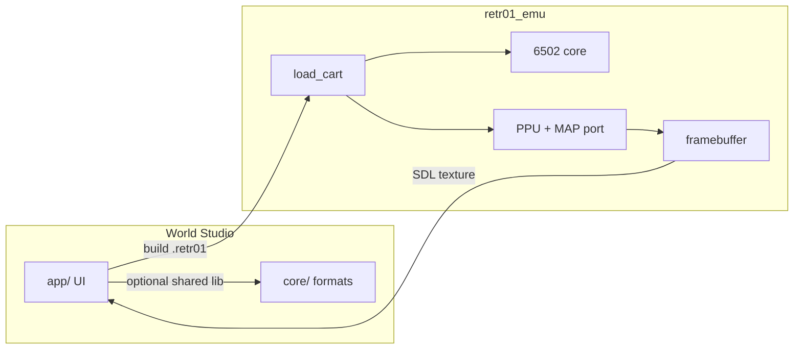

# 08 — Preview and testing

How World Studio validates work in `retr01_emu` before hardware exists, and what “done” means for each feature.

## Preview architecture



**Preferred integration:** link `retr01_emu` as a static library with a C API:

```c
typedef struct retr01_emu retr01_emu_t;

retr01_emu_t *retr01_emu_create(void);
int retr01_emu_load_cart(retr01_emu_t *e, const char *path);
void retr01_emu_run_frame(retr01_emu_t *e);
const uint8_t *retr01_emu_framebuffer(retr01_emu_t *e);
void retr01_emu_set_input(retr01_emu_t *e, uint8_t p1_stick, uint8_t p1_buttons);
void retr01_emu_destroy(retr01_emu_t *e);
```

Fallback v1: spawn `retr01_emu` subprocess with cart path (simpler, no hot reload).

## Live Preview panel

| Mode | Description |
|------|-------------|
| **Embedded** | Texture blit of 256×240 framebuffer in dock |
| **External** | “Play in emulator” launches full window |

### Preview data flow

1. User clicks **Preview** (without full build): load CHR + MAP from memory if emulator API supports RAM load; else write temp `.retr01` to `build/.preview.retr01`
2. Pack movement stub runs generated `world_init` + pack `engine.s` — requires at least one successful PRG build
3. Input from focused preview panel → `$FE60` mapping per [07 spec](../markdown_v_01/07_emulator_specification.md)

### Hot reload (Phase 4)

| Change | Reload strategy |
|--------|-----------------|
| Tile paint + Generate | Reload CHR only |
| World grid edit | Reload MAP + reset CPU |
| World mode pack change | Rebuild PRG required |
| Palette edit | Reload palette regs |

## Test ROM strategy

Fixture projects in `tests/fixtures/`:

| Fixture | Tests |
|---------|-------|
| `single_room.r01proj` | 1×1, `single_screen` pack |
| `linear_h.r01proj` | 14×1, seam east |
| `parallax_sky.r01proj` | Playfield + H parallax span 2 |
| `chr_overflow.r01proj` | Negative test — build must fail |

Each fixture has expected:

- MAP byte size range
- PRG symbol presence (`world_init`)
- Emulator run: 300 frames without crash

## Manual test checklist (v1 release)

### Screen Painter

- [ ] Paint tile, undo, save, reload — pixels match
- [ ] Generate with 256 unique tiles — success
- [ ] Generate with 257 — blocked with error
- [ ] Attr overlay shows correct 2×2 cells
- [ ] PNG reference overlay aligns

### World Grid

- [ ] Add 64 screens — 65th blocked
- [ ] Parallax cell not selectable as start
- [ ] Delete screen removes directory entry on build

### Build

- [ ] Validate catches invalid pack override
- [ ] `build/game.retr01` loads in emulator
- [ ] MAP + CHR + PRG sizes within budget

### `side_platformer`

- [ ] Player moves 4/8-way
- [ ] Camera scrolls horizontally
- [ ] Walk off east edge — neighbor screen streams in
- [ ] Isolated screen — empty template black beyond edge

### Parallax

- [ ] Sky band visible at configured scanlines
- [ ] Camera forced to H or V while plane active
- [ ] `clear_parallax` restores CAM_BOTH (manual stub trigger in debug menu)

### Fade (if links configured)

- [ ] Door link triggers palette fade table
- [ ] No pixel scroll during fade frame range

## Automated tests

### Unit (`core/`, `pack/`)

- RLE round-trip
- attr get/set edge tiles (0,0), (31,29)
- MAP directory 64 entries max
- JSON load corrupt file → error

### Integration

```bash
retr01_studio --build tests/fixtures/linear_h.r01proj -o /tmp/out.retr01
retr01_emu --headless --cart /tmp/out.retr01 --frames 600 --dump-fb /tmp/fb.raw
# compare fb.raw to tests/golden/linear_h_600.raw
```

Golden updates require intentional `--update-golden` flag.

## Lint vs validate vs build

| Command | Scope |
|---------|-------|
| **Lint** (world mode) | Pack overrides, parallax vs camera |
| **Validate** | Full project schema + caps |
| **Build** | Validate + cc65 + cart write |

Lint is fast; runs on pack dropdown change in UI.

## Debug overlays (preview)

Optional ImGui toggles:

- Seam margin (2 tiles from edge)
- VRAM slot boundaries (2×2 camera field)
- `map_x`, `map_y`, `scroll_x`, `scroll_y` HUD
- Raster line for parallax band

## Emulator parity requirement

Studio and emulator must share:

- `core/rle.c` decoder
- MAP directory parsing
- Attr unpack for PPU (or bit-identical logic)

Drift causes “works in preview, fails on hardware” — treat shared code as a hard rule in Phase 0.

## Related docs

- UI preview panel: [02_ui.md](02_ui.md)
- Emulator spec: [07_emulator_specification.md](../markdown_v_01/07_emulator_specification.md)
- Build phases: [07_build_pipeline.md](07_build_pipeline.md)
