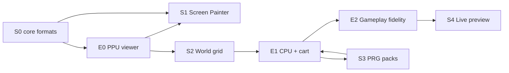

# 10 — Emulator development (when and how)

World Studio **produces** carts; `retr01_emu` **consumes** them. The emulator should be built **early**, in layers, because it is **simpler than the full Studio** and is the main way to verify formats, MAP export, and (later) PRG packs.

Canonical hardware behavior: [`markdown_v_01/07_emulator_specification.md`](../../markdown_v_01/07_emulator_specification.md).

## Complexity comparison

| | Minimal emulator (first milestone) | World Studio v1 (full) |
|--|-----------------------------------|-------------------------|
| UI | SDL window, maybe a debug HUD | SDL + **Dear ImGui**, 9 panels, dock layout |
| Input | Optional (keyboard → `$FE60` later) | Painting, grid edit, property inspectors |
| Formats | Load `.retr01`, RLE decode, CHR blit | Same **plus** encode, MAP build, `.r01proj`, validation |
| CPU | **None** at first (viewer mode) | cc65, 5 world-mode packs, generated ASM |
| PPU | One nametable slot, scroll regs, palette | Preview embed + hot reload |
| APU / IRQ / parallax | Deferred | Studio configures; emu must catch up |

**Conclusion:** the first useful emulator (static screen viewer) is a **small C + SDL program** sharing `core/` with the Studio. Full Studio is strictly more work. Start the emulator **right after shared `core/` exists** (end of Studio Phase 0), not after the editor is finished.

## Layered emulator milestones

Build in three layers. Each layer unblocks specific Studio phases.



### E0 — PPU viewer (start here)

**When:** immediately after **Studio Phase 0** (`core/` RLE, MAP parse, `.retr01` load, palette v01).

**Goal:** prove **CHR + MAP + palette** without a 6502.

| In scope | Out of scope |
|----------|--------------|
| Load `.retr01` via shared `core/cart_io.c` | 6502 execution |
| MAP `$FE90` read path or direct call to `retr01_screen_rle_decode` | APU |
| Decompress one screen → VRAM slot 0 (1200 bytes) | Raster IRQ, parallax planes |
| PPU: tile fetch from CHR, per-tile attrs, master palette → 256×240 framebuffer | `load_screen` in guest PRG |
| SDL present loop | Input, OAM sprites |

**Test harness API (planning):**

```c
/* retr01_emu/test/view_one_screen.c — or emu --view-screen map_off */
int emu_view_screen(const retr01_cart_t *cart, int world, int col, int row);
```

**Studio unblock:** Screen Painter (Phase 1) can export CHR + one screen blob → open in E0 and **see pixels**.

**Exit criterion:** fixture cart shows correct 256×240 image; attr colors match editor preview.

---

### E1 — CPU + bus + runnable PRG

**When:** before or in parallel with **Studio Phase 3** (world-mode packs + cc65).

**Goal:** run a **minimal test ROM** and then Studio-built `.retr01` with PRG.

| Add | Still defer |
|-----|-------------|
| W65C02S core, `bus_read`/`bus_write` | Cycle-perfect APU audio |
| `system_ram[]`, `io_regs[]`, `$FE30` banks | Full parallax raster split |
| Cart PRG mapped per [08_memory_map.md](../../markdown_v_01/08_memory_map.md) | Every `$FExx` bit exact |
| NMI frame loop, keyboard → `$FE60` | Embedded Studio preview |
| Guest `load_screen` / seam helpers **or** syscall stubs for MAP load | |

**Studio unblock:** Build dialog “Play in emulator” works; gallery cart with movement stub.

**Exit criterion:** `side_platformer` test cart runs 600 frames headless without crash; scroll changes visible output.

---

### E2 — Spec fidelity (ongoing)

**When:** during **Studio Phase 4** and after v1 ships.

**Goal:** match [07_emulator_specification.md](../../markdown_v_01/07_emulator_specification.md) for hardware validation.

- Raster compare + IRQ, mid-frame bank switch
- Parallax planes (slots 4–5), `set_parallax` behavior
- OAM, sprite limit, priority bit
- APU → SDL audio
- MAP `load_screen` entirely in guest PRG (no test harness shortcuts)

**Studio unblock:** Live preview panel with faithful scroll, parallax band, fade tables.

---

## Repo layout

Emulator lives as a **sibling** of World Studio; both link shared format code:

```text
retr01/
  retr01_world_studio/
    core/           # RLE, MAP, cart I/O, palette — SHARED
    pack/           # Studio-only (canvas → CHR)
    app/            # Studio-only (ImGui)
    runtime/        # Studio-only (6502 templates)
  retr01_emu/
    ppu/            # E0: framebuffer path first
    cart/           # wraps core/cart_io or duplicates thin wrapper
    cpu/            # E1+
    bus/
    mem/
    apu/            # E2
    host/           # SDL main, input
    test/           # view_one_screen, headless runner
```

**Shared library option:** build `retr01_world_studio/core` as `libretr01_core.a` linked by both `retr01_studio` and `retr01_emu`. Single RLE decoder — no drift.

---

## Integrated step list (Studio + emulator)

Use this as the master checklist. Emulator steps are **first-class**, not an afterthought.

| Step | Studio | Emulator | Validates |
|------|--------|----------|-----------|
| **0** | `core/`: RLE, screen, MAP builder, `.retr01` write, palette load, unit tests | — | Format round-trips |
| **E0** | — | PPU viewer: load cart, decode 1 screen, blit | CHR + MAP + attrs + palette |
| **1** | Screen Painter, CHR Generate, save `.r01proj` | Use E0 to view exports | Editor ↔ pixels |
| **2** | World grid, full MAP export | E0: switch `(col,row)` / multi-screen directory | Atlas + RLE at scale |
| **E1** | — | CPU, bus, I/O, run test PRG | PRG mapping, NMI loop |
| **3** | World-mode packs, cc65, Build → `.retr01` | E1: Play built cart | End-to-end cart |
| **E2** | — | Parallax, IRQ, OAM, APU | Hardware spec parity |
| **4** | Embed emu in Studio preview | E2 stable API | Edit → preview loop |

**Rule:** do **not** start Studio Phase 1 until **E0** can display at least one fixture screen. Do **not** ship Studio Phase 3 Build until **E1** runs a built cart.

---

## Minimal E0 implementation sketch

Order of work inside `retr01_emu/` (estimated ~1 week after Phase 0):

1. `main.c` — SDL window 512×480, nearest-neighbor 256×240 texture
2. Link `libretr01_core` — `retr01_cart_load("test.retr01")`
3. `ppu_render_bg()` — for each pixel `(x,y)`: map through scroll to `(tx,ty)`, read tile + attr, fetch 8×8 CHR tile, apply palette
4. `map_load_screen_to_vram()` — directory lookup + `retr01_screen_rle_decode` → `vram[0]`
5. CLI: `retr01_emu --cart game.retr01 --world 0 --col 0 --row 0` (static view)

No CPU required for step 5 to be useful.

---

## Testing contract

Add tests **with each E0/E1/E2 milestone** — see [11_testing_policy.md](11_testing_policy.md).

| Layer | Command (planning) |
|-------|-------------------|
| E0 | `ctest` → `test_ppu_blit`; `retr01_emu --cart fixtures/one_screen.retr01 --dump-fb out.raw` |
| E1 | `ctest` → bus/CPU smoke; `retr01_emu --headless --cart build/test.retr01 --frames 600` |
| Studio CI | `ctest` + build fixture → E1 headless → exit 0 |

Golden framebuffer hashes live beside fixtures in `retr01_emu/test/golden/`.

---

## Related docs

- Studio phases: [07_build_pipeline.md](07_build_pipeline.md)
- Preview embed: [08_preview_and_testing.md](08_preview_and_testing.md)
- Emulator spec: [`markdown_v_01/07_emulator_specification.md`](../../markdown_v_01/07_emulator_specification.md)
- MAP / RLE: [06_data_formats.md](06_data_formats.md)
- Testing policy: [11_testing_policy.md](11_testing_policy.md)
